# SẢN PHẨM BÀN GIAO D01: SƠ ĐỒ ERD LOGIC & THUYẾT MINH QUAN HỆ
## MODULE CRM CHUỖI BÁN LẺ CÔNG NGHỆ CELLPHONES (TRÊN FRAPPE FRAMEWORK)

**Mã sản phẩm:** D01  
**Thuộc nhiệm vụ:** Nhiệm vụ 1 (Sàng lọc & Xác định thực thể) & Nhiệm vụ 2 (Xây dựng ERD Logic & Giải quyết 2 bài toán dữ liệu)  
**Tác giả:** Trần Quang Huy (System Analyst & Project Manager)  
**Nền tảng mục tiêu:** Frappe Framework v15 / ERPNext v15  
**Trạng thái:** Hoàn thiện Mốc M4 (Final Deliverable)

---

## PHẦN 1: BẢNG DANH MỤC THỰC THỂ & BIỆN LUẬN PHẠM VI (NHIỆM VỤ 1)

Dưới đây là bảng sàng lọc toàn bộ các thực thể dữ liệu dựa trên bài toán bán lẻ đa kênh, quản lý chi nhánh Showroom, chương trình hội viên Smember, dữ liệu lịch sử mua hàng, tiếp nhận khiếu nại và bảo hành sửa chữa (Điện Thoại Vui) của CellphoneS:

| STT | Tên thực thể (Logical / Physical) | Mục đích sử dụng trong CRM CellphoneS | Quyết định | Lý do biện luận nghiệp vụ & kỹ thuật Frappe |
| :---: | :--- | :--- | :---: | :--- |
| **1** | **Chi nhánh / Cửa hàng** `BRANCH_STORE` | Quản lý mạng lưới hơn 100 Showroom CellphoneS và Trung tâm sửa chữa - bảo hành Điện Thoại Vui trên toàn quốc. | **CHỌN (Cốt lõi Cơ sở)** | Làm cơ sở phân vùng địa lý, điều phối kỹ thuật viên, gắn địa điểm tiếp nhận Ticket, phân bổ suất đặt trước iPhone (Pre-order Quota) và lưu dấu nơi phát sinh đơn mua hàng. |
| **2** | **Khách hàng** `CUSTOMER` | Quản lý thông tin định danh cá nhân, số điện thoại duy nhất, CCCD, địa chỉ, trạng thái tài khoản. | **CHỌN (Cốt lõi)** | Thực thể trung tâm của CRM. Ánh xạ trực tiếp sang DocType `Customer` của Frappe Framework. |
| **3** | **Hồ sơ Hội viên Smember** `SMEMBER_PROFILE` | Quản lý hạng thành viên (Smember Standard, S-VIP), tổng tiền tích lũy chi tiêu lũy kế, điểm thưởng hiện có, hạn duy trì hạng VIP. | **CHỌN (Tách biệt / Mở rộng)** | Tách biệt với thông tin cá nhân cơ bản để dễ dàng tùy biến chính sách nâng/hạ hạng mà không phá vỡ cấu trúc DocType `Customer` gốc. Quan hệ 1-1 với `Customer`. |
| **4** | **Nhu cầu tư vấn / Cơ hội** `LEAD_OPPORTUNITY` | Theo dõi khách để lại thông tin đặt trước (Pre-order iPhone/Samsung Flagship), đăng ký nhận báo giá khuyến mãi, hoặc nhu cầu tư vấn mua trả góp qua Telesales/Landing page. | **CHỌN (Cốt lõi Telesales)** | Giữ vai trò then chốt cho đội ngũ Omnichannel/Telesales. Khi khách chốt cọc hoặc mua máy, Lead được chuyển đổi (Convert) thành Khách hàng (`Customer`) và Đơn hàng. |
| **5** | **Tương tác đa kênh** `CUSTOMER_INTERACTION` | Ghi nhận nhật ký mỗi lần tiếp xúc qua Hotline 1800, Chat Zalo OA/Fanpage, Website Chat hoặc trực tiếp tại quầy Showroom. | **CHỌN (Cốt lõi CSKH)** | Giúp nhân viên có cái nhìn toàn diện (360 độ) về lịch sử trao đổi của khách. Đóng vai trò làm nguồn gốc phát sinh Ticket khi cuộc gọi/chat có khiếu nại. |
| **6** | **Phiếu hỗ trợ** `SUPPORT_TICKET` | Quản lý toàn bộ vòng đời khiếu nại, yêu cầu đổi trả 1-đổi-1 trong 30 ngày, tiếp nhận bảo hành, điều phối sửa chữa Điện Thoại Vui, cam kết SLA. | **CHỌN (Cốt lõi Service)** | Nghiệp vụ trung tâm của CSKH. Ánh xạ sang Custom DocType `Support Ticket` với Workflow 5 trạng thái chuẩn hóa. |
| **7** | **Dữ liệu mua hàng / Hóa đơn** `SALES_INVOICE_REFERENCE` | Lưu thông tin tham chiếu hóa đơn mua hàng: Mã hóa đơn, Ngày mua, Chi nhánh xuất bán, Thiết bị kèm số IMEI/Serial, Giá trị thanh toán, Hạn bảo hành gốc. | **CHỌN (Dữ liệu mua hàng)** | Phục vụ tra cứu lịch sử mua hàng, xác thực điều kiện đổi mới 1-đổi-1 trong 30 ngày cho hội viên S-VIP và tích lũy doanh số Smember. |
| **8** | **Chi tiết linh kiện / Ngoại quan** `TICKET_REPAIR_ITEM` | Lưu danh sách lỗi linh kiện (màn hình, pin, bo mạch nguồn), tình trạng ngoại quan lúc nhận máy (trầy xước, cấn móp), phụ kiện kèm theo máy. | **CHỌN (Child Table)** | Thiết kế dưới dạng Bảng con (Child Table) gắn trực tiếp vào `SUPPORT_TICKET` thay vì bảng độc lập lớn, tối ưu kiến trúc Frappe. |
| **9** | **Nhật ký xử lý phiếu** `TICKET_ACTIVITY_LOG` | Ghi nhận các bước xử lý nội bộ, chuyển ca, ghi chú kỹ thuật viên Điện Thoại Vui, kết quả kiểm định lỗi. | **CHỌN (Child Table / Timeline)** | Bổ sung Child Table để lưu các ghi chú kỹ thuật phân quyền chuyên biệt giữa Showroom và Kỹ thuật viên DTV. |
| **10** | **Sản phẩm tham chiếu** `ITEM_REFERENCE` | Lưu danh mục sản phẩm kinh doanh: Mã SKU, Tên sản phẩm, Thương hiệu (Apple, Samsung...), Ngành hàng, Thời gian bảo hành tiêu chuẩn. | **CHỌN (Mức tham chiếu)** | Không quản lý kế toán/tồn kho phức tạp trong module CRM; chỉ lưu dữ liệu tham chiếu để kiểm tra điều kiện bảo hành và tư vấn bán hàng. |
| **11** | **Người dùng / Nhân sự** `STAFF_USER` | Đại diện cho nhân viên trực tổng đài CSKH, nhân viên tư vấn Showroom, Quản lý CSKH và Kỹ thuật viên Điện Thoại Vui. | **CHỌN (Hệ thống)** | Sử dụng DocType `User` chuẩn của Frappe Framework kết hợp phân quyền Role Permission Manager. |
| **12** | **Lịch sử gộp hồ sơ** `CUSTOMER_MERGE_LOG` | Lưu vết kiểm toán (Audit Trail) khi tiến hành gộp 2 hồ sơ khách hàng trùng lặp: ai gộp, hồ sơ phụ bị gộp, hồ sơ chính giữ lại, số Ticket/Tương tác/Điểm đã dời. | **CHỌN (Kiểm toán)** | Đảm bảo tính minh bạch dữ liệu và phục vụ rollback khi cần đối soát điểm tích lũy Smember. |

---

## PHẦN 2: SƠ ĐỒ ERD LOGIC HỆ THỐNG CRM CELLPHONES (NHIỆM VỤ 2)

Sơ đồ ERD Logic dưới đây thể hiện rõ cấu trúc các bảng thực thể, Khóa chính (PK), Khóa ngoại (FK), kiểu dữ liệu, các thuộc tính then chốt và bản số quan hệ (Cardinality / Optionality):

```mermaid
erDiagram
    BRANCH_STORE ||--o{ STAFF_USER : "employs (1-N)"
    BRANCH_STORE ||--o{ LEAD_OPPORTUNITY : "receives preorder (1-N)"
    BRANCH_STORE ||--o{ CUSTOMER_INTERACTION : "hosts walk-in (1-N)"
    BRANCH_STORE ||--o{ SUPPORT_TICKET : "handles at (1-N)"
    BRANCH_STORE ||--o{ SALES_INVOICE_REFERENCE : "issues (1-N)"

    CUSTOMER ||--o| SMEMBER_PROFILE : "has profile (1-1)"
    CUSTOMER ||--o{ CUSTOMER_INTERACTION : "makes (1-N)"
    CUSTOMER ||--o{ SUPPORT_TICKET : "requests (1-N)"
    CUSTOMER ||--o{ LEAD_OPPORTUNITY : "converted from (0..1-N)"
    CUSTOMER ||--o{ SALES_INVOICE_REFERENCE : "purchases (1-N)"
    CUSTOMER ||--o{ CUSTOMER_MERGE_LOG : "source or target (1-N)"

    STAFF_USER ||--o{ CUSTOMER_INTERACTION : "handled by (1-N)"
    STAFF_USER ||--o{ SUPPORT_TICKET : "assigned to (1-N)"
    STAFF_USER ||--o{ LEAD_OPPORTUNITY : "assigned to (1-N)"
    STAFF_USER ||--o{ CUSTOMER_MERGE_LOG : "executed by (1-N)"

    ITEM_REFERENCE ||--o{ SUPPORT_TICKET : "referenced in (1-N)"
    ITEM_REFERENCE ||--o{ LEAD_OPPORTUNITY : "interested in (1-N)"
    ITEM_REFERENCE ||--o{ SALES_INVOICE_REFERENCE : "contains item (1-N)"

    SALES_INVOICE_REFERENCE ||--o{ SUPPORT_TICKET : "verified against (0..1-N)"

    SUPPORT_TICKET ||--o{ TICKET_REPAIR_ITEM : "contains repair items (1-N)"
    SUPPORT_TICKET ||--o{ TICKET_ACTIVITY_LOG : "logs process actions (1-N)"
    CUSTOMER_INTERACTION ||--o| SUPPORT_TICKET : "escalated into (0..1-1)"

    BRANCH_STORE {
        string branch_id PK "Mã chi nhánh (BR-XXXXX)"
        string branch_name "Tên chi nhánh Showroom / Trung tâm DTV"
        string branch_type "Loại (Showroom_Store / Dien_Thoai_Vui_Center)"
        string address "Địa chỉ chi tiết cửa hàng"
        string province_city "Tỉnh / Thành phố"
        string hotline "Số điện thoại hotline chi nhánh"
        string manager_user FK "Quản lý chi nhánh (Link Staff_User)"
        boolean is_active "Đang hoạt động (Yes/No)"
    }

    CUSTOMER {
        string customer_id PK "Mã định danh KH (CUST-YYYY-XXXXX)"
        string phone_number UK "Số điện thoại duy nhất (Regex 10 số)"
        string full_name "Họ và tên khách hàng"
        string email "Email liên hệ"
        string identity_card "Số CCCD / CMND (9 hoặc 12 số)"
        date date_of_birth "Ngày sinh"
        string gender "Giới tính (Nam / Nữ / Khác)"
        string primary_address "Địa chỉ liên hệ"
        string province_city "Tỉnh / Thành phố"
        string customer_type "Loại KH (Individual / Corporate / Anonymous)"
        string status "Trạng thái (Active / Inactive / Merged)"
        datetime created_at "Thời gian tạo"
    }

    SMEMBER_PROFILE {
        string profile_id PK "Mã hồ sơ Smember (SMB-XXXXX)"
        string customer_id FK "Liên kết Khách hàng (1-1 Unique)"
        string member_tier "Hạng hội viên (Smember / S-VIP)"
        currency total_spent "Tổng tiền tích lũy chi tiêu (VND)"
        int reward_points "Điểm thưởng Smember khả dụng"
        date tier_expiry_date "Hạn duy trì hạng VIP"
        datetime last_upgrade_date "Ngày thăng hạng gần nhất"
    }

    LEAD_OPPORTUNITY {
        string lead_id PK "Mã cơ hội (LEAD-YYYY-XXXXX)"
        string lead_name "Tên khách tiềm năng"
        string phone_number "Số điện thoại liên hệ"
        string email "Email liên hệ"
        string channel "Kênh tiếp nhận (Website / Facebook / Zalo / Store)"
        string item_sku FK "Sản phẩm quan tâm (Link Item_Reference)"
        string branch_id FK "Chi nhánh nhận máy / tư vấn (Link Branch_Store)"
        string lead_type "Loại nhu cầu (Pre_Order / Tra_Gop / Tu_Van)"
        string status "Trạng thái (Open / Contacted / Qualified / Converted / Lost)"
        string assigned_to FK "Nhân viên Telesales phụ trách (Link Staff_User)"
        string converted_customer_id FK "Mã KH sau chuyển đổi (Nullable)"
        text notes "Ghi chú nhu cầu tư vấn"
    }

    CUSTOMER_INTERACTION {
        string interaction_id PK "Mã tương tác (INT-YYYY-XXXXX)"
        string customer_id FK "Mã khách hàng (Nullable - Hỗ trợ vãng lai)"
        string contact_phone "SĐT người gọi / chat"
        string contact_name "Tên người liên hệ"
        string channel "Kênh (Hotline_1800 / Zalo_OA / Fanpage / Showroom)"
        string branch_id FK "Chi nhánh tiếp nhận (Link Branch_Store)"
        string interaction_type "Phân loại (Tu_van / Don_hang / Bao_hanh / Khieu_nai)"
        text summary "Nội dung tóm tắt cuộc trao đổi"
        string satisfaction_rating "Đánh giá CSAT (1-5 Sao)"
        string staff_id FK "Nhân viên tiếp nhận (Link Staff_User)"
        datetime interaction_time "Thời điểm phát sinh tương tác"
        string escalated_ticket_id FK "Ticket phát sinh nếu có (Nullable)"
    }

    SUPPORT_TICKET {
        string ticket_id PK "Mã phiếu hỗ trợ (TCK-YYYY-XXXXX)"
        string customer_id FK "Mã khách hàng (Nullable - Hỗ trợ vãng lai)"
        string contact_phone "Số điện thoại liên hệ"
        string contact_name "Họ tên người yêu cầu"
        string channel "Kênh tiếp nhận (Hotline / Store / Zalo / Web)"
        string branch_id FK "Chi nhánh tiếp nhận ban đầu (Link Branch_Store)"
        string item_sku FK "Mã sản phẩm lỗi (Link Item_Reference)"
        string serial_imei "Số Serial / IMEI thiết bị (15 số GSMA)"
        string sales_invoice_id FK "Mã hóa đơn mua hàng (Link Invoice - Nullable)"
        string issue_category "Loại vấn đề (Loi_phan_cung / Doi_tra_30_ngay / Dich_vu)"
        string priority "Độ ưu tiên (Low / Medium / High / Critical)"
        string status "Trạng thái (Open / In_Progress / Pending_Vendor / Resolved / Closed)"
        string assigned_staff FK "Nhân viên xử lý chính (Link Staff_User)"
        string assigned_department "Đơn vị xử lý (CSKH_Store / Dien_Thoai_Vui / Hang)"
        datetime sla_deadline "Hạn chót xử lý theo SLA"
        datetime resolved_time "Thời điểm giải quyết xong"
        datetime closed_time "Thời điểm đóng phiếu chính thức"
        string resolution_type "Hình thức giải quyết (Doi_may_moi / Sua_chua / Hoan_tien / Tu_choi)"
        text root_cause "Nguyên nhân lỗi kỹ thuật"
        text resolution_notes "Ghi chú hướng khắc phục"
        string csat_score "Điểm đánh giá hài lòng (1-5 Sao)"
    }

    SALES_INVOICE_REFERENCE {
        string invoice_id PK "Mã hóa đơn mua hàng (INV-YYYY-XXXXX)"
        string customer_id FK "Mã khách hàng mua (Link Customer)"
        string branch_id FK "Chi nhánh xuất bán (Link Branch_Store)"
        string item_sku FK "Mã sản phẩm mua (Link Item_Reference)"
        string serial_imei "Số Serial / IMEI xuất kho"
        datetime purchase_date "Ngày giờ mua hàng"
        currency grand_total "Tổng giá trị thanh toán (VND)"
        date warranty_expiry_date "Ngày hết hạn bảo hành gốc"
        string payment_method "Phương thức (Tien_mat / Chuyen_khoan / Tra_gop)"
        string invoice_status "Trạng thái (Paid / Returned / Cancelled)"
    }

    TICKET_REPAIR_ITEM {
        string row_id PK "Mã dòng chi tiết"
        string ticket_id FK "Mã phiếu hỗ trợ cha"
        string fault_component "Linh kiện lỗi (Man_hinh / Pin / Mainboard / Camera / Loa)"
        string initial_condition "Tình trạng ngoại quan (May_dep / Tray_xuoc / Can_mop / Vo_kinh)"
        string accessories_included "Phụ kiện kèm theo (Hop, Sac, Cap, Khong)"
        currency estimated_cost "Chi phí dự kiến (nếu ngoài bảo hành)"
        string warranty_status "Diện bảo hành (Chinh_hang / VIP_1_doi_1 / Co_phi)"
    }

    TICKET_ACTIVITY_LOG {
        string log_id PK "Mã nhật ký xử lý"
        string ticket_id FK "Mã phiếu hỗ trợ cha"
        string staff_id FK "Nhân viên thực hiện thao tác (Link Staff_User)"
        string action_type "Hành động (Chuyen_trang_thai / Phan_cong / Ghi_chu / Gui_SMS)"
        string from_status "Trạng thái cũ"
        string to_status "Trạng thái mới"
        text comment "Nội dung ghi chú chi tiết"
        datetime logged_at "Thời gian ghi nhận"
    }

    ITEM_REFERENCE {
        string item_sku PK "Mã sản phẩm / SKU (SP-XXXXX)"
        string item_name "Tên sản phẩm thương mại"
        string brand "Thương hiệu (Apple / Samsung / Xiaomi / Asus / Sony)"
        string category "Ngành hàng (Phone / Tablet / Laptop / Accessory)"
        int warranty_months "Thời gian bảo hành tiêu chuẩn (Tháng)"
        boolean is_active "Đang kinh doanh (Yes/No)"
    }

    STAFF_USER {
        string user_id PK "Tên đăng nhập / Email (user@cellphones.com.vn)"
        string full_name "Họ và tên nhân viên"
        string role "Vai trò (CSKH_Agent / CSKH_Manager / Ky_thuat_DTV / Store_Staff)"
        string branch_id FK "Chi nhánh trực thuộc (Link Branch_Store)"
        boolean is_active "Đang hoạt động (Yes/No)"
    }

    CUSTOMER_MERGE_LOG {
        string merge_id PK "Mã phiên gộp (MRG-YYYY-XXXXX)"
        string source_customer_id FK "Mã hồ sơ phụ bị gộp"
        string target_customer_id FK "Mã hồ sơ chính giữ lại"
        string merge_reason "Lý do gộp (Trung_SDT / Cung_CCCD / Yeu_cau_khach)"
        int migrated_tickets_count "Số lượng Ticket đã chuyển giao"
        int migrated_interactions_count "Số lượng Tương tác đã chuyển giao"
        currency transferred_points "Số điểm Smember đã dồn"
        string executed_by FK "Nhân viên thực hiện gộp (Link Staff_User)"
        datetime executed_at "Thời gian thực hiện"
    }
```

---

## PHẦN 3: ĐẶC TẢ QUAN HỆ & BỘI SỐ CHI TIẾT (CARDINALITY & MULTIPLICITY)

| Cặp thực thể (Cha $\rightarrow$ Con) | Bội số (Cardinality) | Tính bắt buộc (Optionality) | Giải thích logic nghiệp vụ CellphoneS |
| :--- | :---: | :---: | :--- |
| `BRANCH_STORE` $\rightarrow$ `STAFF_USER` | $1 - N$ | Mandatory $\rightarrow$ Optional | Một chi nhánh có nhiều nhân viên làm việc; mỗi nhân viên trực thuộc 1 chi nhánh chính. |
| `BRANCH_STORE` $\rightarrow$ `SALES_INVOICE_REFERENCE` | $1 - N$ | Mandatory $\rightarrow$ Optional | Một chi nhánh xuất nhiều hóa đơn bán hàng; mỗi hóa đơn gắn liền với 1 chi nhánh xuất hàng. |
| `BRANCH_STORE` $\rightarrow$ `SUPPORT_TICKET` | $1 - N$ | Mandatory $\rightarrow$ Optional | Một chi nhánh tiếp nhận nhiều phiếu hỗ trợ; mỗi phiếu ghi nhận nơi tiếp nhận ban đầu. |
| `CUSTOMER` $\rightarrow$ `SMEMBER_PROFILE` | $1 - 1$ | Mandatory $\rightarrow$ Mandatory | Mỗi khách hàng có duy nhất 1 hồ sơ Smember quản lý tích lũy chi tiêu và hạng thẻ VIP. |
| `CUSTOMER` $\rightarrow$ `SALES_INVOICE_REFERENCE` | $1 - N$ | Mandatory $\rightarrow$ Optional | Một khách hàng có thể mua nhiều đơn hàng theo thời gian; hóa đơn phải thuộc về 1 khách hàng xác định. |
| `CUSTOMER` $\rightarrow$ `SUPPORT_TICKET` | $1 - N$ | Optional $\rightarrow$ Optional | Một khách hàng có thể mở nhiều phiếu hỗ trợ. Trường `customer_id` là Nullable để hỗ trợ Khách vãng lai. |
| `CUSTOMER` $\rightarrow$ `CUSTOMER_INTERACTION` | $1 - N$ | Optional $\rightarrow$ Optional | Một khách hàng có thể gọi hotline/chat nhiều lần. Nullable để tiếp nhận cuộc gọi hỏi giá ẩn danh. |
| `CUSTOMER` $\rightarrow$ `LEAD_OPPORTUNITY` | $1 - N$ | Optional $\rightarrow$ Optional | Khách tiềm năng sau khi chốt mua sẽ chuyển đổi liên kết sang 1 bản ghi `CUSTOMER`. |
| `ITEM_REFERENCE` $\rightarrow$ `SALES_INVOICE_REFERENCE` | $1 - N$ | Mandatory $\rightarrow$ Optional | Mỗi dòng hóa đơn tham chiếu đến 1 mã SKU sản phẩm kèm số IMEI/Serial cụ thể. |
| `ITEM_REFERENCE` $\rightarrow$ `SUPPORT_TICKET` | $1 - N$ | Mandatory $\rightarrow$ Optional | Mỗi phiếu hỗ trợ tiếp nhận sửa chữa/đổi trả cho 1 model sản phẩm xác định. |
| `SALES_INVOICE_REFERENCE` $\rightarrow$ `SUPPORT_TICKET` | $1 - N$ | Optional $\rightarrow$ Optional | Khi khách bảo hành, hệ thống đối soát với hóa đơn mua cũ để kiểm tra thời hạn 30 ngày đổi mới. |
| `SUPPORT_TICKET` $\rightarrow$ `TICKET_REPAIR_ITEM` | $1 - N$ | Mandatory $\rightarrow$ Optional | Một phiếu hỗ trợ có thể bao gồm nhiều linh kiện cần kiểm tra (màn hình, pin, vỏ máy...). |
| `SUPPORT_TICKET` $\rightarrow$ `TICKET_ACTIVITY_LOG` | $1 - N$ | Mandatory $\rightarrow$ Optional | Một phiếu hỗ trợ lưu lại toàn bộ tiến trình ghi chú kỹ thuật, chuyển trạng thái qua các ca làm việc. |
| `CUSTOMER_INTERACTION` $\rightarrow$ `SUPPORT_TICKET` | $1 - 1$ | Optional $\rightarrow$ Optional | Một cuộc gọi/chat khiếu nại có thể được leo thang (escalate) tạo nhanh thành 1 phiếu hỗ trợ. |
| `CUSTOMER` $\rightarrow$ `CUSTOMER_MERGE_LOG` | $1 - N$ | Mandatory $\rightarrow$ Optional | Một khách hàng có thể đóng vai trò là hồ sơ nguồn (bị gộp) hoặc hồ sơ đích (giữ lại) trong nhật ký gộp. |

---

## PHẦN 4: THUYẾT MINH GIẢI PHÁP 2 BÀI TOÁN DỮ LIỆU ĐẶC THÙ CELLPHONES

### 4.1. Bài toán 1: Xử lý Khách hàng chưa xác định (Khách vãng lai / Ẩn danh)

#### Bối cảnh thực tế tại CellphoneS:
* Khách gọi điện thoại lên Hotline 1800.2097 chỉ hỏi giá hoặc tình trạng tồn kho ở Showroom gần nhất rồi cúp máy.
* Khách nhắn tin qua Fanpage/Zalo bằng tài khoản phụ, không để lại số điện thoại cá nhân.
* Khách ghé Showroom hỏi tư vấn dán màn hình/phụ kiện mà không muốn cung cấp thông tin đăng ký thành viên.

#### Giải pháp Thiết kế Cơ sở Dữ liệu:
Hệ thống CRM CellphoneS áp dụng giải pháp kép **"Nullable FK kết hợp Bản ghi Sentinel Mặc định"**:
1. **Ràng buộc trường `customer_id`:** Trong thực thể `CUSTOMER_INTERACTION` và `SUPPORT_TICKET`, khóa ngoại `customer_id` được đặt ở chế độ **Nullable (Không bắt buộc nhập)**. Đi kèm là 2 trường lưu tạm: `contact_phone` và `contact_name`.
2. **Bản ghi mặc định (Sentinel Record):** Hệ thống khởi tạo sẵn một bản ghi Khách hàng hệ thống:
   * `customer_id` = `CUST-GUEST`
   * `full_name` = `Khách vãng lai CellphoneS`
   * `phone_number` = `0000000000`
   * `customer_type` = `Anonymous`
   * `status` = `Active`
3. **Quy tắc định danh muộn (Late Identification Workflow):**
   * Nếu trong quá trình tương tác, khách hàng đồng ý cung cấp SĐT: Nhân viên bấm nút *"Tạo / Liên kết Khách hàng"* trên form tương tác.
   * Hệ thống tự động truy vấn tìm `phone_number` trong bảng `CUSTOMER`:
     * **Nếu đã tồn tại:** Cập nhật `customer_id` của tương tác đó trỏ về ID khách hàng tìm thấy.
     * **Nếu chưa tồn tại:** Mở form tạo nhanh `CUSTOMER`, sinh mã `CUST-YYYY-XXXXX`, cập nhật lại khóa ngoại cho tương tác và khởi tạo `SMEMBER_PROFILE` với mức khởi điểm.

---

### 4.2. Bài toán 2: Xử lý Hồ sơ Trùng lặp (Customer Deduplication & Merge)

#### Bối cảnh thực tế tại CellphoneS:
* Khách mua hàng tại cửa hàng cung cấp SĐT 1 (Ví dụ mạng Viettel), khi mua online lại nhập SĐT 2 (VinaPhone) nhưng cùng số CCCD/Email và tên người nhận.
* Nhân viên Showroom tạo nhanh thông tin khách hàng bị gõ sai chính tả hoặc sai 1 chữ số điện thoại, dẫn đến tồn tại 2 hồ sơ song song của cùng 1 người.

#### Giải pháp Thiết kế Cơ sở Dữ liệu & Quy trình Gộp (Merge Strategy):
1. **Định danh duy nhất (Unique Constraints):**
   * Trường `phone_number` trong bảng `CUSTOMER` được đánh chỉ mục **UNIQUE**. Hệ thống ngăn chặn việc tạo 2 bản ghi có cùng số điện thoại.
   * Bảng cảnh báo trùng lặp tiềm năng (Duplicate Candidate Detection) quét tự động theo: `identity_card` (CCCD) hoặc `email`.
2. **Cơ chế Gộp hồ sơ (Merge Customer Operation):**
   Khi Người quản lý (CSKH Manager) xác nhận 2 hồ sơ thuộc về cùng 1 khách hàng:
   * **Xác định Hồ sơ Chính (Target Profile):** Hồ sơ có lịch sử chi tiêu Smember cao hơn hoặc cập nhật gần nhất.
   * **Xác định Hồ sơ Phụ (Source Profile):** Hồ sơ cần gộp vào.
   * **Thực thi chuyển dịch dữ liệu (Foreign Key Re-pointing Transaction):**
     $$\text{UPDATE } \text{SUPPORT\_TICKET SET } customer\_id = \text{Target\_ID WHERE } customer\_id = \text{Source\_ID}$$
     $$\text{UPDATE } \text{CUSTOMER\_INTERACTION SET } customer\_id = \text{Target\_ID WHERE } customer\_id = \text{Source\_ID}$$
     $$\text{UPDATE } \text{LEAD\_OPPORTUNITY SET } converted\_customer\_id = \text{Target\_ID WHERE } converted\_customer\_id = \text{Source\_ID}$$
     $$\text{UPDATE } \text{SALES\_INVOICE\_REFERENCE SET } customer\_id = \text{Target\_ID WHERE } customer\_id = \text{Source\_ID}$$
   * **Dồn điểm thưởng Smember & Doanh số chi tiêu:**
     $$\text{Target.total\_spent} = \text{Target.total\_spent} + \text{Source.total\_spent}$$
     $$\text{Target.reward\_points} = \text{Target.reward\_points} + \text{Source.reward\_points}$$
   * **Đánh dấu lưu trữ hồ sơ phụ:** Cập nhật `Source.status = 'Merged'` và `Source.phone_number = Source.phone_number + '_MERGED_' + timestamp` để giải phóng ràng buộc Unique cho số điện thoại nếu cần tái sử dụng.
   * **Ghi nhật ký kiểm toán:** Tạo một bản ghi mới trong bảng `CUSTOMER_MERGE_LOG` lưu đầy đủ thông tin: ai gộp, nguồn, đích, số lượng Ticket/Tương tác và số điểm tích lũy đã dời để phục vụ truy vết kiểm toán.

---

## PHẦN 5: TÍNH TOÀN VẸN & KHÔNG TRÙNG LẮP KHÁI NIỆM (COMPLIANCE CHECK)

1. **Chuẩn hóa bậc 3 (3NF):**
   * Các bảng không chứa thuộc tính lặp.
   * Thông tin hội viên Smember được tách riêng (`SMEMBER_PROFILE`) giúp tối ưu hiệu năng và không làm phình to bảng khách hàng cơ bản.
   * Chi tiết kiểm tra máy được tách ra bảng con `TICKET_REPAIR_ITEM` thay vì để nhiều cột dạng `component_1, component_2` trong bảng `SUPPORT_TICKET`.
   * Thông tin chi nhánh tách riêng `BRANCH_STORE` giúp đồng bộ dữ liệu cửa hàng toàn quốc.
2. **Quan hệ không lơ lửng:** 100% Khóa ngoại (FK) đều có bảng cha tương ứng, hỗ trợ cơ chế `ON DELETE RESTRICT` để bảo vệ dữ liệu lịch sử chăm sóc khách hàng và kiểm toán.
