# SẢN PHẨM BÀN GIAO D01: SƠ ĐỒ ERD LOGIC & THUYẾT MINH QUAN HỆ
## MODULE CRM CHUỖI BÁN LẺ CÔNG NGHỆ CELLPHONES (TRÊN FRAPPE FRAMEWORK)

**Mã sản phẩm:** D01  
**Thuộc nhiệm vụ:** Nhiệm vụ 1 (Sàng lọc & Xác định thực thể) & Nhiệm vụ 2 (Xây dựng ERD Logic & Giải quyết 2 bài toán dữ liệu)  
**Tác giả:** Trần Quang Huy (System Analyst & Project Manager)  
**Nền tảng mục tiêu:** Frappe Framework v15 / ERPNext v15  
**Trạng thái:** Hoàn thiện Mốc M4 (Final Deliverable)

---

## TỔNG QUAN PHẠM VI & RANH GIỚI NGHIỆP VỤ CRM CELLPHONES

Dự án tập trung xây dựng phân hệ Quản lý Quan hệ Khách hàng (**CRM**) chuyên biệt cho chuỗi bán lẻ công nghệ **CellphoneS** với các phạm vi và ranh giới đã được xác định cụ thể:

1. **Phạm vi khách hàng & mô hình kinh doanh:**
   * **Mô hình:** B2C (Business to Customer) thuần túy.
   * **Đối tượng:** Toàn bộ là **Khách hàng cá nhân**, không phục vụ khách hàng doanh nghiệp (B2B/Corporate).

2. **Ngành hàng và Sản phẩm nghiên cứu:**
   * Tập trung 3 nhóm ngành hàng bán lẻ cốt lõi của CellphoneS:
     * **Điện thoại** (*Smartphones* - Apple iPhone, Samsung Galaxy, Xiaomi...).
     * **Laptop** (*Máy tính xách tay* - MacBook, Asus, Dell, Lenovo...).
     * **Phụ kiện** (*Accessories* - Tai nghe, Củ cáp sạc, Pin dự phòng, Ốp lưng, Chuột, Bàn phím...).

3. **Nhóm người dùng hệ thống CRM (CRM Users):**
   * **Nhân viên tư vấn (Sales / Telesales / Store Consultant):** Tiếp nhận khách tiềm năng (Lead), tư vấn cấu hình/giá bán, chốt cơ hội đơn hàng, tư vấn trả góp hoặc nhận đặt cọc trước (Pre-order).
   * **Nhân viên CSKH (Customer Care / Support Agent):** Tiếp nhận tương tác đa kênh (Hotline, Chat, Showroom), ghi nhận khiếu nại, tạo và theo dõi tiến độ phiếu hỗ trợ/bảo hành.
   * **Quản lý cửa hàng (Store Manager):** Giám sát tiếp nhận tại Showroom, phân công nhân sự, duyệt xử lý yêu cầu đổi trả đặc biệt và theo dõi SLA tại chi nhánh.
   * **Quản trị viên (System Administrator):** Cấu hình hệ thống, phân quyền vai trò (Role Permission), giám sát dữ liệu và thực hiện kiểm toán gộp hồ sơ khách hàng.
   * **Nhân viên phân tích (Data / Business Analyst):** Khai thác báo cáo hiệu quả bán hàng, tỷ lệ chuyển đổi cơ hội, phân tích thời gian xử lý SLA, tỷ lệ khiếu nại theo dòng sản phẩm.

4. **5 Nhóm nghiệp vụ chính:**
   * **Nghiệp vụ 1: Quản lý khách hàng tiềm năng (Lead Management):** Thu thập, làm giàu và phân loại thông tin khách có nhu cầu mua sắm.
   * **Nghiệp vụ 2: Tư vấn và quản lý cơ hội bán hàng (Opportunity & Sales Pipeline):** Quản lý tiến trình tư vấn theo từng ngành hàng (Điện thoại/Laptop/Phụ kiện), chính sách trả góp, đặt trước.
   * **Nghiệp vụ 3: Chăm sóc và duy trì quan hệ khách hàng (Customer Care & Loyalty Profile):** Quản lý hồ sơ 360°, lịch sử tương tác đa kênh và lưu trữ thông tin hội viên Smember.
   * **Nghiệp vụ 4: Hỗ trợ và xử lý hậu mãi (After-sales & Warranty Support):** Tiếp nhận yêu cầu bảo hành, 1-đổi-1 trong 30 ngày, theo dõi tiến độ xử lý và cam kết thời gian hoàn thành (SLA).
   * **Nghiệp vụ 5: Quản lý hiệu quả hoạt động CRM (CRM Performance & Analytics):** Giám sát hiệu suất tư vấn, chỉ số hài lòng CSAT, SLA giải quyết khiếu nại và báo cáo tổng hợp.

5. **Ranh giới nghiệp vụ (Scope Boundaries):**
   * **Về Bảo hành / Đổi trả:** Hệ thống CRM tập trung **quản lý yêu cầu, ghi nhận tình trạng máy lúc tiếp nhận và theo dõi tiến độ xử lý (SLA)** giữa Showroom và bộ phận liên quan; **CHƯA** quản lý chi tiết sửa chữa kỹ thuật/thay thế linh kiện chuyên sâu và **CHƯA** thực hiện hoàn tiền (nghiệp vụ tài chính/hoàn tiền thuộc hệ thống Kế toán - POS).
   * **Về Hội viên SMember:** Hệ thống CRM trước mắt **lưu trữ và tra cứu hạng thành viên (Smember, S-VIP...)**, lịch sử hạng và ngày gia hạn; **CHƯA** tự động tính toán tích/trừ điểm thưởng phức tạp và **CHƯA** tự động chạy thuật toán xét nâng/hạ hạng (dữ liệu này được tiếp nhận và đồng bộ từ hệ thống Loyalty/POS trung tâm).

---

## PHẦN 1: BẢNG DANH MỤC THỰC THỂ & BIỆN LUẬN PHẠM VI (NHIỆM VỤ 1)

Dưới đây là bảng sàng lọc toàn bộ các thực thể dữ liệu được thiết kế tối ưu cho bài toán CRM bán lẻ công nghệ CellphoneS:

| STT | Tên thực thể (Logical / Physical) | Mục đích sử dụng trong CRM CellphoneS | Quyết định | Lý do biện luận nghiệp vụ & kỹ thuật Frappe |
| :---: | :--- | :--- | :---: | :--- |
| **1** | **Chi nhánh / Cửa hàng** `BRANCH_STORE` | Quản lý hệ thống các cửa hàng / Showroom CellphoneS trên toàn quốc. | **CHỌN (Cơ sở phân vùng)** | Đóng vai trò phân vùng địa lý, gắn địa điểm tiếp nhận Ticket, phân bổ cơ hội tư vấn theo khu vực và lưu dấu nơi phát sinh đơn mua hàng. |
| **2** | **Khách hàng** `CUSTOMER` | Quản lý thông tin định danh cá nhân khách hàng B2C: Họ tên, Số điện thoại (duy nhất), CCCD/CMND, Địa chỉ, Ngày sinh, Giới tính. | **CHỌN (Cốt lõi)** | Thực thể trung tâm của toàn bộ hệ thống CRM. Ánh xạ trực tiếp sang DocType `Customer` của Frappe Framework. Chỉ quản lý khách hàng cá nhân. |
| **3** | **Hồ sơ Hội viên Smember** `SMEMBER_PROFILE` | Lưu trữ và tra cứu thông tin hạng thành viên Smember (Smember Standard, S-VIP), ngày kích hoạt, ngày hết hạn hạng thẻ. | **CHỌN (Tra cứu / Lưu trữ)** | Tách biệt với thông tin cá nhân cơ bản để phục vụ tra cứu chính sách ưu đãi khách hàng mà không phá vỡ cấu trúc DocType `Customer`. Quan hệ 1-1 với `Customer`. |
| **4** | **Khách tiềm năng & Cơ hội** `LEAD_OPPORTUNITY` | Quản lý thông tin khách quan tâm Điện thoại, Laptop, Phụ kiện, đăng ký đặt trước (Pre-order), nhận tư vấn mua trả góp qua Web/Hotline/Showroom. | **CHỌN (Cốt lõi Tư vấn)** | Giữ vai trò then chốt cho đội ngũ Tư vấn/Telesales. Khi khách chốt mua máy, Lead được chuyển đổi (Convert) thành Khách hàng (`Customer`) và Đơn hàng. |
| **5** | **Tương tác đa kênh** `CUSTOMER_INTERACTION` | Ghi nhận nhật ký mỗi lần tiếp xúc qua Hotline 1800.2097, Chat Zalo OA/Fanpage, Website Chat hoặc trực tiếp tại quầy Showroom. | **CHỌN (Cốt lõi CSKH)** | Giúp nhân viên có cái nhìn 360 độ về lịch sử trao đổi của khách. Đóng vai trò làm nguồn gốc phát sinh Phiếu hỗ trợ khi có thắc mắc/khiếu nại. |
| **6** | **Phiếu hỗ trợ / Bảo hành** `SUPPORT_TICKET` | Tiếp nhận và theo dõi tiến độ xử lý yêu cầu bảo hành, đổi trả 1-đổi-1 trong 30 ngày, thắc mắc đơn hàng và cam kết thời gian SLA. | **CHỌN (Cốt lõi Hậu mãi)** | Quản lý vòng đời tiếp nhận & tiến độ xử lý hậu mãi. Ánh xạ sang Custom DocType `Support Ticket` với Workflow chuẩn hóa, không quản lý chi tiết sửa chữa hay hoàn tiền. |
| **7** | **Chi tiết thiết bị tiếp nhận** `TICKET_ITEM_CONDITION` | Ghi nhận tình trạng ngoại quan lúc nhận máy (máy đẹp, trầy xước, cấn móp, nứt vỡ) và phụ kiện đi kèm (hộp, sạc, cáp) khi lập phiếu hỗ trợ. | **CHỌN (Child Table)** | Thiết kế dưới dạng Bảng con (Child Table) gắn trực tiếp vào `SUPPORT_TICKET` nhằm lưu chứng cứ biên bản bàn giao máy, không quản lý kho linh kiện kỹ thuật. |
| **8** | **Nhật ký tiến độ xử lý** `TICKET_ACTIVITY_LOG` | Ghi nhận các bước xử lý nội bộ, chuyển ca tiếp nhận, cập nhật trạng thái phiếu hỗ trợ, ghi chú liên hệ khách hàng. | **CHỌN (Child Table / Timeline)** | Lưu tiến trình phân công và xử lý công việc giữa các bộ phận, phục vụ đo lường thời gian thực hiện theo cam kết SLA. |
| **9** | **Dữ liệu mua hàng tham chiếu** `SALES_INVOICE_REFERENCE` | Lưu thông tin tham chiếu hóa đơn mua hàng: Mã hóa đơn, Ngày mua, Chi nhánh xuất bán, Sản phẩm kèm số IMEI/Serial, Hạn bảo hành gốc. | **CHỌN (Tham chiếu Mua hàng)** | Phục vụ tra cứu lịch sử mua hàng, xác thực điều kiện áp dụng chính sách đổi mới 1-đổi-1 trong 30 ngày và đối soát bảo hành chính hãng. |
| **10** | **Sản phẩm tham chiếu** `ITEM_REFERENCE` | Danh mục sản phẩm kinh doanh thuộc 3 ngành hàng: Điện thoại, Laptop, Phụ kiện (Mã SKU, Tên sản phẩm, Thương hiệu, Thời gian bảo hành). | **CHỌN (Mức tham chiếu)** | Không quản lý kế toán/tồn kho phức tạp trong CRM; chỉ lưu dữ liệu tham chiếu để chọn sản phẩm khi tư vấn cơ hội và kiểm tra điều kiện tiếp nhận bảo hành. |
| **11** | **Người dùng hệ thống** `STAFF_USER` | Đại diện cho 5 nhóm nhân sự: Nhân viên tư vấn, Nhân viên CSKH, Quản lý cửa hàng, Quản trị viên, Nhân viên phân tích. | **CHỌN (Hệ thống)** | Sử dụng DocType `User` chuẩn của Frappe Framework kết hợp phân quyền Role Permission Manager để kiểm soát quyền hạn dữ liệu. |
| **12** | **Nhật ký gộp hồ sơ** `CUSTOMER_MERGE_LOG` | Lưu vết kiểm toán (Audit Trail) khi tiến hành gộp 2 hồ sơ khách hàng cá nhân bị trùng lặp số điện thoại hoặc thông tin định danh. | **CHỌN (Kiểm toán)** | Đảm bảo tính toàn vẹn dữ liệu, ghi nhận rõ ai thực hiện, hồ sơ bị gộp, hồ sơ giữ lại và số lượng Ticket/Tương tác đã di dời. |

---

## PHẦN 2: SƠ ĐỒ ERD LOGIC HỆ THỐNG CRM CELLPHONES (NHIỆM VỤ 2)

Sơ đồ ERD Logic thể hiện cấu trúc các thực thể, Khóa chính (PK), Khóa ngoại (FK), kiểu dữ liệu thuộc tính và bản số quan hệ (Cardinality & Optionality):

```mermaid
erDiagram
    BRANCH_STORE ||--o{ STAFF_USER : "employs (1-N)"
    BRANCH_STORE ||--o{ LEAD_OPPORTUNITY : "assigned to (1-N)"
    BRANCH_STORE ||--o{ CUSTOMER_INTERACTION : "hosts walk-in (1-N)"
    BRANCH_STORE ||--o{ SUPPORT_TICKET : "receives at (1-N)"
    BRANCH_STORE ||--o{ SALES_INVOICE_REFERENCE : "issues (1-N)"

    CUSTOMER ||--o| SMEMBER_PROFILE : "has membership (1-1)"
    CUSTOMER ||--o{ CUSTOMER_INTERACTION : "participates (1-N)"
    CUSTOMER ||--o{ SUPPORT_TICKET : "requests (1-N)"
    CUSTOMER ||--o{ LEAD_OPPORTUNITY : "converted from (0..1-N)"
    CUSTOMER ||--o{ SALES_INVOICE_REFERENCE : "owns (1-N)"
    CUSTOMER ||--o{ CUSTOMER_MERGE_LOG : "source or target (1-N)"

    STAFF_USER ||--o{ CUSTOMER_INTERACTION : "handled by (1-N)"
    STAFF_USER ||--o{ SUPPORT_TICKET : "assigned to (1-N)"
    STAFF_USER ||--o{ LEAD_OPPORTUNITY : "consults (1-N)"
    STAFF_USER ||--o{ CUSTOMER_MERGE_LOG : "executed by (1-N)"
    STAFF_USER ||--o{ TICKET_ACTIVITY_LOG : "logs action (1-N)"

    ITEM_REFERENCE ||--o{ SUPPORT_TICKET : "referenced in (1-N)"
    ITEM_REFERENCE ||--o{ LEAD_OPPORTUNITY : "interested in (1-N)"
    ITEM_REFERENCE ||--o{ SALES_INVOICE_REFERENCE : "sold item (1-N)"

    SALES_INVOICE_REFERENCE ||--o{ SUPPORT_TICKET : "verified against (0..1-N)"

    SUPPORT_TICKET ||--o{ TICKET_ITEM_CONDITION : "checks condition (1-N)"
    SUPPORT_TICKET ||--o{ TICKET_ACTIVITY_LOG : "records progress (1-N)"
    CUSTOMER_INTERACTION ||--o| SUPPORT_TICKET : "escalated into (0..1-1)"

    BRANCH_STORE {
        string branch_id PK "Mã chi nhánh (BR-XXXXX)"
        string branch_name "Tên chi nhánh Showroom CellphoneS"
        string address "Địa chỉ chi tiết cửa hàng"
        string province_city "Tỉnh / Thành phố"
        string hotline "Số điện thoại hotline chi nhánh"
        string manager_user FK "Quản lý cửa hàng (Link Staff_User)"
        boolean is_active "Đang hoạt động (Yes/No)"
    }

    CUSTOMER {
        string customer_id PK "Mã định danh KH (CUST-YYYY-XXXXX)"
        string phone_number UK "Số điện thoại duy nhất (10 chữ số)"
        string full_name "Họ và tên khách hàng cá nhân"
        string email "Email liên hệ cá nhân"
        string identity_card "Số CCCD / CMND (9 hoặc 12 số)"
        date date_of_birth "Ngày sinh"
        string gender "Giới tính (Nam / Nu / Khac)"
        string address "Địa chỉ liên hệ"
        string province_city "Tỉnh / Thành phố"
        string status "Trạng thái (Active / Inactive / Merged)"
        datetime created_at "Thời gian tạo"
    }

    SMEMBER_PROFILE {
        string profile_id PK "Mã hồ sơ Smember (SMB-XXXXX)"
        string customer_id FK "Liên kết Khách hàng cá nhân (1-1 Unique)"
        string member_tier "Hạng hội viên (Smember / S-VIP / S-New)"
        date join_date "Ngày tham gia hội viên"
        date tier_expiry_date "Hạn duy trì hạng hiện tại"
        string tier_note "Ghi chú quyền lợi chính sách"
    }

    LEAD_OPPORTUNITY {
        string lead_id PK "Mã cơ hội (LEAD-YYYY-XXXXX)"
        string lead_name "Tên khách tiềm năng"
        string phone_number "Số điện thoại liên hệ"
        string email "Email liên hệ"
        string channel "Kênh tiếp nhận (Website / Facebook / Zalo / Showroom)"
        string product_category "Ngành hàng quan tâm (Dien_thoai / Laptop / Phu_kien)"
        string item_sku FK "Sản phẩm cụ thể quan tâm (Link Item_Reference)"
        string branch_id FK "Chi nhánh tư vấn / nhận máy (Link Branch_Store)"
        string consultation_type "Loại nhu cầu (Tu_van / Dat_truoc_PreOrder / Tra_gop)"
        string status "Trạng thái (New / Contacted / Qualified / Converted / Lost)"
        string assigned_to FK "Nhân viên tư vấn phụ trách (Link Staff_User)"
        string converted_customer_id FK "Mã KH sau chuyển đổi (Link Customer - Nullable)"
        text notes "Nội dung nhu cầu tư vấn"
    }

    CUSTOMER_INTERACTION {
        string interaction_id PK "Mã tương tác (INT-YYYY-XXXXX)"
        string customer_id FK "Mã khách hàng (Link Customer - Nullable)"
        string contact_phone "SĐT người liên hệ"
        string contact_name "Họ tên người liên hệ"
        string channel "Kênh (Hotline_1800 / Zalo_OA / Fanpage / Showroom)"
        string branch_id FK "Chi nhánh tiếp nhận (Link Branch_Store)"
        string interaction_purpose "Mục đích (Tu_van / Don_hang / Ho_tro_ky_thuat / Khieu_nai)"
        text summary "Tóm tắt nội dung trao đổi"
        string satisfaction_rating "Đánh giá CSAT (1-5 Sao)"
        string staff_id FK "Nhân viên tiếp nhận (Link Staff_User)"
        datetime interaction_time "Thời điểm phát sinh tương tác"
        string escalated_ticket_id FK "Phiếu hỗ trợ phát sinh (Link Support_Ticket - Nullable)"
    }

    SUPPORT_TICKET {
        string ticket_id PK "Mã phiếu hỗ trợ (TCK-YYYY-XXXXX)"
        string customer_id FK "Mã khách hàng (Link Customer - Nullable)"
        string contact_phone "Số điện thoại liên hệ"
        string contact_name "Họ tên người yêu cầu"
        string channel "Kênh tiếp nhận (Hotline / Showroom / Zalo / Web)"
        string branch_id FK "Chi nhánh tiếp nhận ban đầu (Link Branch_Store)"
        string item_sku FK "Mã sản phẩm tiếp nhận (Link Item_Reference)"
        string serial_imei "Số Serial / IMEI thiết bị (15 số GSMA)"
        string sales_invoice_id FK "Hóa đơn mua hàng đối soát (Link Sales_Invoice - Nullable)"
        string issue_type "Loại yêu cầu (Tiep_nhan_bao_hanh / Doi_tra_30_ngay / Khieu_nai_dich_vu)"
        string priority "Độ ưu tiên (Low / Medium / High / Urgent)"
        string status "Trạng thái (Open / In_Progress / Pending_Vendor / Resolved / Closed)"
        string assigned_staff FK "Nhân viên xử lý tiến độ (Link Staff_User)"
        datetime sla_deadline "Hạn chót giải quyết theo SLA"
        datetime resolved_time "Thời điểm giải quyết xong"
        datetime closed_time "Thời điểm đóng phiếu"
        string resolution_result "Kết quả xử lý (Doi_may_moi / Chuyen_bao_hanh_hang / Huong_dan_khach / Tu_choi)"
        text customer_feedback "Ý kiến và phản hồi của khách hàng"
        string csat_score "Điểm hài lòng CSAT (1-5 Sao)"
    }

    TICKET_ITEM_CONDITION {
        string row_id PK "Mã dòng chi tiết"
        string ticket_id FK "Mã phiếu hỗ trợ cha (Link Support_Ticket)"
        string reported_issue "Mô tả hiện tượng lỗi từ khách hàng"
        string physical_condition "Tình trạng ngoại quan (May_dep / Tray_xuoc / Can_mop / Nut_kinh)"
        string accessories_included "Phụ kiện kèm theo (Hop, Cu_sac, Day_cap, Khong)"
        string warranty_eligibility "Điều kiện tiếp nhận (Hop_le / Tu_choi_do_roi_nuoc / Het_han)"
    }

    TICKET_ACTIVITY_LOG {
        string log_id PK "Mã nhật ký xử lý"
        string ticket_id FK "Mã phiếu hỗ trợ cha (Link Support_Ticket)"
        string staff_id FK "Nhân viên cập nhật (Link Staff_User)"
        string action_type "Hành động (Cap_nhat_tien_do / Chuyen_trang_thai / Phan_cong / Ghi_chu)"
        string from_status "Trạng thái trước"
        string to_status "Trạng thái sau"
        text progress_notes "Ghi chú tiến độ chi tiết"
        datetime logged_at "Thời gian ghi nhận"
    }

    SALES_INVOICE_REFERENCE {
        string invoice_id PK "Mã hóa đơn mua hàng (INV-YYYY-XXXXX)"
        string customer_id FK "Mã khách hàng mua (Link Customer)"
        string branch_id FK "Chi nhánh xuất bán (Link Branch_Store)"
        string item_sku FK "Mã sản phẩm mua (Link Item_Reference)"
        string serial_imei "Số Serial / IMEI xuất kho"
        datetime purchase_date "Ngày giờ mua hàng"
        currency grand_total "Tổng giá trị thanh toán (VND)"
        date warranty_expiry_date "Ngày hết hạn bảo hành gốc"
        string invoice_status "Trạng thái hóa đơn (Paid / Exchanged / Cancelled)"
    }

    ITEM_REFERENCE {
        string item_sku PK "Mã sản phẩm / SKU (SP-XXXXX)"
        string item_name "Tên sản phẩm thương mại"
        string brand "Thương hiệu (Apple / Samsung / Asus / Xiaomi / Sony...)"
        string category "Ngành hàng (Dien_thoai / Laptop / Phu_kien)"
        int warranty_months "Thời gian bảo hành tiêu chuẩn (Tháng)"
        boolean is_active "Đang kinh doanh (Yes/No)"
    }

    STAFF_USER {
        string user_id PK "Tên đăng nhập / Email (user@cellphones.com.vn)"
        string full_name "Họ và tên nhân viên"
        string role "Vai trò (Nhan_vien_tu_van / Nhan_vien_CSKH / Quan_ly_cua_hang / Quan_tri_vien / Chuyen_vien_phan_tich)"
        string branch_id FK "Chi nhánh trực thuộc (Link Branch_Store)"
        boolean is_active "Đang hoạt động (Yes/No)"
    }

    CUSTOMER_MERGE_LOG {
        string merge_id PK "Mã phiên gộp (MRG-YYYY-XXXXX)"
        string source_customer_id FK "Mã hồ sơ phụ bị gộp (Link Customer)"
        string target_customer_id FK "Mã hồ sơ chính giữ lại (Link Customer)"
        string merge_reason "Lý do gộp (Trung_SDT / Cung_CCCD / Yeu_cau_khach_hang)"
        int migrated_tickets_count "Số lượng Ticket đã chuyển giao"
        int migrated_interactions_count "Số lượng Tương tác đã chuyển giao"
        string executed_by FK "Quản trị viên thực hiện (Link Staff_User)"
        datetime executed_at "Thời gian thực hiện"
    }
```

---

## PHẦN 3: ĐẶC TẢ QUAN HỆ & BỘI SỐ CHI TIẾT (CARDINALITY & MULTIPLICITY)

| Cặp thực thể (Cha $\rightarrow$ Con) | Bội số (Cardinality) | Tính bắt buộc (Optionality) | Giải thích logic nghiệp vụ CRM CellphoneS |
| :--- | :---: | :---: | :--- |
| `BRANCH_STORE` $\rightarrow$ `STAFF_USER` | $1 - N$ | Mandatory $\rightarrow$ Optional | Một chi nhánh có nhiều nhân sự làm việc (Tư vấn, CSKH, Quản lý); mỗi nhân sự thuộc một chi nhánh chính. |
| `BRANCH_STORE` $\rightarrow$ `SALES_INVOICE_REFERENCE` | $1 - N$ | Mandatory $\rightarrow$ Optional | Một cửa hàng xuất nhiều hóa đơn bán hàng cho khách; hóa đơn lưu vết chi nhánh xuất hàng. |
| `BRANCH_STORE` $\rightarrow$ `SUPPORT_TICKET` | $1 - N$ | Mandatory $\rightarrow$ Optional | Một chi nhánh tiếp nhận nhiều phiếu hỗ trợ/bảo hành từ khách hàng mang máy đến. |
| `CUSTOMER` $\rightarrow$ `SMEMBER_PROFILE` | $1 - 1$ | Mandatory $\rightarrow$ Mandatory | Mỗi khách hàng cá nhân có duy nhất 1 hồ sơ Smember phục vụ tra cứu hạng thành viên và quyền lợi ưu đãi. |
| `CUSTOMER` $\rightarrow$ `SALES_INVOICE_REFERENCE` | $1 - N$ | Mandatory $\rightarrow$ Optional | Một khách hàng cá nhân có thể mua nhiều sản phẩm qua nhiều đơn hàng theo thời gian. |
| `CUSTOMER` $\rightarrow$ `SUPPORT_TICKET` | $1 - N$ | Optional $\rightarrow$ Optional | Một khách hàng có thể mở nhiều phiếu hỗ trợ. Khóa ngoại `customer_id` là Nullable để hỗ trợ Khách vãng lai. |
| `CUSTOMER` $\rightarrow$ `CUSTOMER_INTERACTION` | $1 - N$ | Optional $\rightarrow$ Optional | Một khách hàng có thể gọi Hotline hoặc Chat nhiều lần. Nullable để tiếp nhận cuộc gọi hỏi giá/tư vấn ẩn danh. |
| `CUSTOMER` $\rightarrow$ `LEAD_OPPORTUNITY` | $1 - N$ | Optional $\rightarrow$ Optional | Khách tiềm năng sau khi chốt đặt trước/tư vấn thành công sẽ được chuyển đổi liên kết với 1 bản ghi `CUSTOMER`. |
| `ITEM_REFERENCE` $\rightarrow$ `SALES_INVOICE_REFERENCE` | $1 - N$ | Mandatory $\rightarrow$ Optional | Mỗi dòng hóa đơn tham chiếu đến 1 mã SKU sản phẩm (Điện thoại/Laptop/Phụ kiện) cụ thể. |
| `ITEM_REFERENCE` $\rightarrow$ `SUPPORT_TICKET` | $1 - N$ | Mandatory $\rightarrow$ Optional | Mỗi phiếu hỗ trợ ghi nhận việc tiếp nhận yêu cầu bảo hành/đổi trả cho 1 dòng sản phẩm cụ thể. |
| `SALES_INVOICE_REFERENCE` $\rightarrow$ `SUPPORT_TICKET` | $1 - N$ | Optional $\rightarrow$ Optional | Khi tiếp nhận máy, nhân viên tra cứu đối soát hóa đơn mua cũ để kiểm tra hạn 30 ngày đổi mới hoặc bảo hành. |
| `SUPPORT_TICKET` $\rightarrow$ `TICKET_ITEM_CONDITION` | $1 - N$ | Mandatory $\rightarrow$ Optional | Một phiếu hỗ trợ có bảng con ghi nhận tình trạng ngoại quan, phụ kiện kèm theo và hiện tượng lỗi của máy. |
| `SUPPORT_TICKET` $\rightarrow$ `TICKET_ACTIVITY_LOG` | $1 - N$ | Mandatory $\rightarrow$ Optional | Một phiếu hỗ trợ lưu lại toàn bộ tiến trình cập nhật tiến độ, trao đổi nội bộ và chuyển trạng thái theo SLA. |
| `CUSTOMER_INTERACTION` $\rightarrow$ `SUPPORT_TICKET` | $1 - 1$ | Optional $\rightarrow$ Optional | Một cuộc gọi Hotline hoặc cuộc Chat phản ánh khiếu nại có thể được tạo nhanh (escalate) thành 1 Phiếu hỗ trợ. |
| `CUSTOMER` $\rightarrow$ `CUSTOMER_MERGE_LOG` | $1 - N$ | Mandatory $\rightarrow$ Optional | Một khách hàng đóng vai trò là hồ sơ nguồn (bị gộp) hoặc hồ sơ đích (giữ lại) trong nhật ký kiểm toán gộp dữ liệu. |

---

## PHẦN 4: THUYẾT MINH GIẢI PHÁP 2 BÀI TOÁN DỮ LIỆU ĐẶC THÙ CELLPHONES

### 4.1. Bài toán 1: Xử lý Khách hàng chưa xác định (Khách vãng lai / Ẩn danh)

#### Bối cảnh thực tế tại CellphoneS:
* Khách gọi lên tổng đài CSKH Hotline 1800.2097 chỉ hỏi giá iPhone mới ra mắt, cấu hình Laptop gaming hoặc tình trạng tồn kho phụ kiện tại chi nhánh gần nhất rồi ngắt máy.
* Khách nhắn tin qua Fanpage/Zalo bằng tài khoản mạng xã hội ẩn danh, không để lại số điện thoại cá nhân.
* Khách ghé trực tiếp Showroom hỏi tham khảo trải nghiệm máy mà chưa có nhu cầu để lại thông tin thành viên.

#### Giải pháp Thiết kế Cơ sở Dữ liệu:
Hệ thống CRM CellphoneS áp dụng giải pháp kết hợp **"Nullable Foreign Key & Bản ghi Sentinel Dự phòng"**:
1. **Ràng buộc trường `customer_id`:** Trong thực thể `CUSTOMER_INTERACTION` và `SUPPORT_TICKET`, khóa ngoại `customer_id` được thiết lập ở chế độ **Nullable (Không bắt buộc nhập)**. Đồng thời bổ sung 2 trường lưu tạm độc lập: `contact_phone` và `contact_name`.
2. **Bản ghi mặc định (Sentinel Record):** Hệ thống khởi tạo sẵn một bản ghi Khách hàng hệ thống:
   * `customer_id` = `CUST-GUEST`
   * `full_name` = `Khách vãng lai CellphoneS`
   * `phone_number` = `0000000000`
   * `status` = `Active`
3. **Quy trình định danh bổ sung (Late Identification Workflow):**
   * Khi khách hàng đồng ý cung cấp Số điện thoại: Nhân viên bấm nút *"Liên kết / Tạo mới Khách hàng"* trên form thao tác.
   * Hệ thống tự động truy vấn tìm `phone_number` trong bảng `CUSTOMER`:
     * **Nếu đã có trên hệ thống:** Gán lại `customer_id` của tương tác/phiếu hỗ trợ trỏ về khách hàng tìm thấy.
     * **Nếu chưa có:** Mở form tạo nhanh `CUSTOMER`, sinh mã `CUST-YYYY-XXXXX`, tự động tạo `SMEMBER_PROFILE` ở hạng khởi điểm (`Smember`) và liên kết ngược lại tương tác.

---

### 4.2. Bài toán 2: Xử lý Hồ sơ Trùng lặp (Customer Deduplication & Merge)

#### Bối cảnh thực tế tại CellphoneS:
* Khách hàng cá nhân khi mua điện thoại tại Showroom cung cấp SĐT 1, khi đặt hàng online laptop trên website lại nhập SĐT 2 nhưng trùng số CCCD hoặc Email.
* Nhân viên Showroom nhập sai chính tả họ tên hoặc gõ nhầm 1 chữ số điện thoại khi tạo nhanh, dẫn đến xuất hiện 2 hồ sơ của cùng một khách hàng.

#### Giải pháp Thiết kế Cơ sở Dữ liệu & Quy trình Gộp (Merge Strategy):
1. **Định danh duy nhất (Unique Constraints):**
   * Trường `phone_number` trong bảng `CUSTOMER` được đánh chỉ mục **UNIQUE**. Hệ thống ngăn chặn việc tạo 2 khách hàng cá nhân có cùng số điện thoại.
   * Hệ thống quét tự động tìm các cặp hồ sơ nghi trùng lặp dựa trên: `identity_card` (CCCD/CMND) hoặc `email`.
2. **Cơ chế Gộp hồ sơ (Merge Customer Operation):**
   Khi Quản trị viên (System Admin) hoặc Quản lý xác nhận 2 hồ sơ thuộc về cùng một người:
   * **Xác định Hồ sơ Chính (Target Profile):** Hồ sơ có thời gian tạo sớm hơn hoặc có hạng Smember cao hơn.
   * **Xác định Hồ sơ Phụ (Source Profile):** Hồ sơ trùng lặp cần gộp vào.
   * **Thực thi chuyển dịch dữ liệu (Foreign Key Re-pointing):**
     $$\text{UPDATE } \text{SUPPORT\_TICKET SET } customer\_id = \text{Target\_ID WHERE } customer\_id = \text{Source\_ID}$$
     $$\text{UPDATE } \text{CUSTOMER\_INTERACTION SET } customer\_id = \text{Target\_ID WHERE } customer\_id = \text{Source\_ID}$$
     $$\text{UPDATE } \text{LEAD\_OPPORTUNITY SET } converted\_customer\_id = \text{Target\_ID WHERE } converted\_customer\_id = \text{Source\_ID}$$
     $$\text{UPDATE } \text{SALES\_INVOICE\_REFERENCE SET } customer\_id = \text{Target\_ID WHERE } customer\_id = \text{Source\_ID}$$
   * **Đánh dấu lưu trữ hồ sơ phụ:** Cập nhật `Source.status = 'Merged'` và đổi số điện thoại thành `Source.phone_number + '_MERGED_' + timestamp` để giải phóng ràng buộc Unique.
   * **Ghi nhật ký kiểm toán:** Khởi tạo bản ghi trong bảng `CUSTOMER_MERGE_LOG` lưu chi tiết: Quản trị viên thực hiện, ID nguồn, ID đích, số lượng Ticket và Tương tác đã chuyển dời.

---

## PHẦN 5: TÍNH TOÀN VẸN & KHÔNG TRÙNG LẮP KHÁI NIỆM (COMPLIANCE CHECK)

1. **Chuẩn hóa bậc 3 (3NF):**
   * Không có thuộc tính lặp hoặc phụ thuộc bắc cầu trong các thực thể.
   * Thông tin hạng hội viên Smember được tách riêng (`SMEMBER_PROFILE`) giúp đảm bảo hiệu năng và giữ vai trò tra cứu quyền lợi rõ ràng.
   * Thông tin tình trạng máy tiếp nhận được tách thành bảng con `TICKET_ITEM_CONDITION` gắn với từng phiếu hỗ trợ, đảm bảo tính trực quan và đúng ranh giới tiếp nhận.
   * Toàn bộ các thực thể phân bổ đúng 3 nhóm sản phẩm (Điện thoại, Laptop, Phụ kiện) và 5 nhóm người dùng hệ thống.
2. **Toàn vẹn tham chiếu (Referential Integrity):**
   * 100% Khóa ngoại (FK) đều có ràng buộc rõ ràng với bảng cha tương ứng.
   * Áp dụng quy tắc `ON DELETE RESTRICT` đối với các bảng giao dịch (`SUPPORT_TICKET`, `CUSTOMER_INTERACTION`, `SALES_INVOICE_REFERENCE`) nhằm ngăn chặn việc vô tình xóa mất lịch sử chăm sóc và bằng chứng dịch vụ của khách hàng.
