# SẢN PHẨM BÀN GIAO D01: SƠ ĐỒ ERD LOGIC & THUYẾT MINH QUAN HỆ
## MODULE CRM CHUỖI BÁN LẺ CÔNG NGHỆ CELLPHONES (TRÊN FRAPPE FRAMEWORK)

**Mã sản phẩm:** D01  
**Thuộc nhiệm vụ:** Nhiệm vụ 1 (Sàng lọc thực thể) & Nhiệm vụ 2 (Xây dựng ERD Logic & Giải quyết 2 bài toán dữ liệu)  
**Tác giả:** Trần Quang Huy (System Analyst & Project Manager)  
**Trạng thái:** Bản nháp Mốc M3 (Draft for Cross-check)

---

## PHẦN 1: BẢNG DANH MỤC THỰC THỂ & BIỆN LUẬN PHẠM VI (NHIỆM VỤ 1)

Dưới đây là bảng sàng lọc toàn bộ các thực thể dữ liệu dựa trên bài toán bán lẻ đa kênh, chương trình hội viên Smember, tiếp nhận khiếu nại và bảo hành sửa chữa (Điện Thoại Vui) của CellphoneS:

| STT | Tên thực thể (Logical / Physical) | Mục đích sử dụng trong CRM CellphoneS | Quyết định | Lý do biện luận nghiệp vụ & kỹ thuật Frappe |
| :---: | :--- | :--- | :---: | :--- |
| **1** | **Khách hàng** `Customer` | Quản lý thông tin định danh cá nhân, số điện thoại, CCCD, địa chỉ, trạng thái tài khoản. | **CHỌN (Cốt lõi)** | Thực thể trung tâm của CRM. Ánh xạ trực tiếp sang DocType `Customer` của Frappe. |
| **2** | **Hồ sơ Smember** `Smember_Profile` | Quản lý hạng thành viên (Smember, S-VIP), tổng tiền tích lũy lũy kế, điểm thưởng hiện có, hạn duy trì hạng. | **CHỌN (Tách biệt / Mở rộng)** | Tách biệt với thông tin cá nhân để dễ dàng thay đổi chính sách hội viên mà không phá vỡ cấu trúc DocType `Customer` gốc. Quan hệ 1-1 với `Customer`. |
| **3** | **Khách tiềm năng / Nhu cầu tư vấn** `Lead_Opportunity` | Theo dõi khách để lại thông tin đặt trước (Pre-order iPhone/Samsung Flagship), đăng ký nhận tin khuyến mãi, hoặc nhu cầu tư vấn mua trả góp qua Telesales/Landing page. | **CHỌN (Cốt lõi Telesales)** | Giữ vai trò then chốt cho đội ngũ Omnichannel/Telesales. Khi khách chốt mua hoặc đặt cọc, Lead sẽ được chuyển đổi (Convert) thành Khách hàng (`Customer`) và Đơn hàng. |
| **4** | **Tương tác đa kênh** `Customer_Interaction` | Ghi nhận nhật ký mỗi lần tiếp xúc qua Hotline tổng đài, Chat Zalo OA/Fanpage, Website Form hoặc trực tiếp tại Showroom CellphoneS. | **CHỌN (Cốt lõi CSKH)** | Giúp nhân viên có cái nhìn toàn diện (360 độ) về lịch sử trao đổi của khách. Đóng vai trò làm nguồn phát sinh Ticket khi cuộc gọi/chat có khiếu nại. |
| **5** | **Phiếu hỗ trợ** `Support_Ticket` | Quản lý toàn bộ vòng đời khiếu nại, yêu cầu đổi trả 1-đổi-1, tiếp nhận bảo hành, chuyển sửa chữa Điện Thoại Vui, cam kết SLA. | **CHỌN (Cốt lõi Service)** | Nghiệp vụ trung tâm của CSKH. Ánh xạ sang `Issue` hoặc Custom DocType `Support Ticket` với Workflow 5 trạng thái. |
| **6** | **Chi tiết linh kiện / Hạng mục kiểm tra** `Ticket_Repair_Item` | Lưu danh sách lỗi linh kiện, phụ kiện kèm theo máy (củ sạc, hộp), tình trạng ngoại quan máy khi nhận bảo hành. | **CHỌN (Child Table)** | Thiết kế dưới dạng Bảng con (Child Table) gắn trực tiếp vào `Support_Ticket` thay vì bảng độc lập lớn, tối ưu kiến trúc Frappe. |
| **7** | **Lịch sử xử lý phiếu** `Ticket_Activity_Log` | Ghi nhận các bước xử lý nội bộ, chuyển ca, ghi chú kỹ thuật viên Điện Thoại Vui, kết quả thẩm định. | **CHỌN (Child Table / Timeline)** | Frappe đã có sẵn `Activity Log / Timeline`, nhưng cần bổ sung Child Table để lưu các ghi chú kỹ thuật phân quyền chuyên biệt. |
| **8** | **Người dùng / Nhân viên** `Staff_User` | Đại diện cho nhân viên trực tổng đài CSKH, nhân viên tư vấn bán hàng Showroom, Quản lý CSKH và Kỹ thuật viên Điện Thoại Vui. | **CHỌN (Hệ thống)** | Sử dụng DocType `User` chuẩn của Frappe Framework kết hợp phân quyền Role Permission. |
| **9** | **Sản phẩm tham chiếu** `Item_Reference` | Lưu thông tin tham chiếu phục vụ tra cứu bảo hành: Mã SKU, Tên sản phẩm, Ngành hàng (iPhone, Android, Laptop, Phụ kiện), Số Serial/IMEI, Hạn bảo hành gốc. | **CHỌN (Mức tham chiếu)** | Không quản lý kế toán/tồn kho phức tạp trong module CRM; chỉ lưu dữ liệu tham chiếu để kiểm tra điều kiện bảo hành và đổi trả. |
| **10** | **Lịch sử gộp hồ sơ** `Customer_Merge_Log` | Lưu vết kiểm toán (Audit Trail) khi tiến hành gộp 2 hồ sơ khách hàng trùng lặp: ai gộp, hồ sơ nguồn, hồ sơ đích, thời gian gộp. | **CHỌN (Kiểm toán)** | Đảm bảo tính minh bạch dữ liệu và phục vụ rollback khi cần đối soát điểm tích lũy Smember. |

---

## PHẦN 2: SƠ ĐỒ ERD LOGIC HỆ THỐNG CRM CELLPHONES (NHIỆM VỤ 2)

Sơ đồ ERD Logic dưới đây thể hiện rõ cấu trúc bảng, Khóa chính (PK), Khóa ngoại (FK), kiểu dữ liệu, các thuộc tính then chốt và bản số quan hệ (Cardinality / Optionality):

```mermaid
erDiagram
    CUSTOMER ||--o| SMEMBER_PROFILE : "has profile (1-1)"
    CUSTOMER ||--o{ CUSTOMER_INTERACTION : "makes (1-N)"
    CUSTOMER ||--o{ SUPPORT_TICKET : "requests (1-N)"
    CUSTOMER ||--o{ LEAD_OPPORTUNITY : "converted from (0..1-N)"
    CUSTOMER ||--o{ CUSTOMER_MERGE_LOG : "source/target (1-N)"

    STAFF_USER ||--o{ CUSTOMER_INTERACTION : "handled by (1-N)"
    STAFF_USER ||--o{ SUPPORT_TICKET : "assigned to (1-N)"
    STAFF_USER ||--o{ LEAD_OPPORTUNITY : "assigned to (1-N)"
    STAFF_USER ||--o{ CUSTOMER_MERGE_LOG : "executed by (1-N)"

    ITEM_REFERENCE ||--o{ SUPPORT_TICKET : "referenced in (1-N)"
    ITEM_REFERENCE ||--o{ LEAD_OPPORTUNITY : "interested in (1-N)"

    SUPPORT_TICKET ||--o{ TICKET_REPAIR_ITEM : "contains details (1-N)"
    SUPPORT_TICKET ||--o{ TICKET_ACTIVITY_LOG : "logs process (1-N)"
    CUSTOMER_INTERACTION ||--o| SUPPORT_TICKET : "escalated into (0..1-1)"

    CUSTOMER {
        string customer_id PK "Mã định danh KH (CUST-YYYY-XXXXX)"
        string phone_number UK "Số điện thoại duy nhất (Regex 10 số)"
        string full_name "Họ và tên khách hàng"
        string email "Email liên hệ"
        string identity_card "Số CCCD / CMND"
        date date_of_birth "Ngày sinh"
        string gender "Giới tính (Nam/Nữ/Khác)"
        string address "Địa chỉ liên hệ"
        string province_city "Tỉnh / Thành phố"
        string customer_type "Loại KH (Individual / Corporate)"
        string status "Trạng thái (Active / Inactive / Merged)"
        datetime created_at "Thời gian tạo"
    }

    SMEMBER_PROFILE {
        string profile_id PK "Mã hồ sơ Smember"
        string customer_id FK "Liên kết Khách hàng (1-1)"
        string member_tier "Hạng hội viên (Smember / S-VIP)"
        currency total_spent "Tổng tiền tích lũy chi tiêu (VND)"
        int reward_points "Điểm thưởng Smember khả dụng"
        date tier_expiry_date "Hạn duy trì hạng thành viên"
        datetime last_upgrade_date "Ngày thăng hạng gần nhất"
    }

    LEAD_OPPORTUNITY {
        string lead_id PK "Mã nhu cầu (LEAD-YYYY-XXXXX)"
        string lead_name "Tên khách tiềm năng"
        string phone_number "Số điện thoại liên hệ"
        string email "Email liên hệ"
        string channel "Kênh tiếp nhận (Website / Facebook / Store)"
        string item_sku FK "Sản phẩm quan tâm (Link Item)"
        string lead_type "Loại nhu cầu (Pre-order / Tra_gop / Tu_van)"
        string status "Trạng thái (Open / Contacted / Qualified / Converted / Lost)"
        string assigned_to FK "Nhân viên Telesales phụ trách (Link User)"
        string converted_customer_id FK "Mã KH sau chuyển đổi (Nullable)"
        text notes "Ghi chú nhu cầu tư vấn"
    }

    CUSTOMER_INTERACTION {
        string interaction_id PK "Mã tương tác (INT-YYYY-XXXXX)"
        string customer_id FK "Mã khách hàng (Nullable - Hỗ trợ vãng lai)"
        string contact_phone "SĐT người gọi / chat"
        string contact_name "Tên người liên hệ"
        string channel "Kênh (Hotline / Zalo_OA / Fanpage / Showroom)"
        string interaction_type "Phân loại (Tu_van_gia / Bao_hanh / Khieu_nai)"
        text summary "Nội dung tóm tắt cuộc trao đổi"
        string satisfaction_rating "Đánh giá CSAT (1-5 Sao)"
        string staff_id FK "Nhân viên tiếp nhận (Link User)"
        datetime interaction_time "Thời điểm phát sinh tương tác"
        string escalated_ticket_id FK "Ticket phát sinh nếu có (Nullable)"
    }

    SUPPORT_TICKET {
        string ticket_id PK "Mã phiếu hỗ trợ (TCK-YYYY-XXXXX)"
        string customer_id FK "Mã khách hàng (Nullable - Hỗ trợ vãng lai)"
        string contact_phone "Số điện thoại liên hệ"
        string contact_name "Họ tên người yêu cầu"
        string channel "Kênh tiếp nhận (Hotline / Store / Zalo)"
        string item_sku FK "Mã sản phẩm lỗi (Link Item Reference)"
        string serial_imei "Số Serial / IMEI thiết bị (15 số)"
        string issue_category "Loại vấn đề (Loi_phan_cung / Doi_tra_30_ngay / Dich_vu)"
        string priority "Độ ưu tiên (Low / Medium / High / Critical)"
        string status "Trạng thái (Open / In_Progress / Pending_Vendor / Resolved / Closed)"
        string assigned_staff FK "Nhân viên xử lý chính (Link User)"
        string assigned_department "Đơn vị xử lý (CSKH_Store / Dien_Thoai_Vui / Hang)"
        datetime sla_deadline "Hạn chót xử lý theo SLA"
        datetime resolved_time "Thời điểm giải quyết xong"
        datetime closed_time "Thời điểm đóng phiếu chính thức"
        string resolution_type "Hình thức giải quyết (Doi_may_moi / Sua_chua / Hoan_tien)"
        text root_cause "Nguyên nhân lỗi kỹ thuật"
        text resolution_notes "Ghi chú hướng khắc phục"
        string csat_score "Điểm đánh giá hài lòng (1-5 Sao)"
    }

    TICKET_REPAIR_ITEM {
        string row_id PK "Mã dòng chi tiết"
        string ticket_id FK "Mã phiếu hỗ trợ cha"
        string fault_component "Linh kiện lỗi (Man_hinh / Pin / Mainboard / Camera)"
        string initial_condition "Tình trạng ngoại quan (Tray_xuoc / Can_mop / Binh_thuong)"
        string accessories_included "Phụ kiện kèm theo (Hop, Sac, Cap, Khong)"
        currency estimated_cost "Chi phí dự kiến (nếu ngoài bảo hành)"
        string warranty_status "Tình trạng bảo hành (Trong_han / Het_han / Tu_choi)"
    }

    TICKET_ACTIVITY_LOG {
        string log_id PK "Mã nhật ký xử lý"
        string ticket_id FK "Mã phiếu hỗ trợ cha"
        string staff_id FK "Nhân viên thực hiện thao tác (Link User)"
        string action_type "Hành động (Chuyen_trang_thai / Phan_cong / Ghi_chu / Gui_SMS)"
        string from_status "Trạng thái cũ"
        string to_status "Trạng thái mới"
        text comment "Nội dung ghi chú chi tiết"
        datetime logged_at "Thời gian ghi nhận"
    }

    ITEM_REFERENCE {
        string item_sku PK "Mã sản phẩm / SKU (SP-XXXXX)"
        string item_name "Tên sản phẩm thương mại"
        string brand "Thương hiệu (Apple / Samsung / Xiaomi / Asus)"
        string category "Ngành hàng (Phone / Tablet / Laptop / Accessory)"
        int warranty_months "Thời gian bảo hành tiêu chuẩn (Tháng)"
        boolean is_active "Đang kinh doanh (Yes/No)"
    }

    STAFF_USER {
        string user_id PK "Tên đăng nhập / Email (user@cellphones.com.vn)"
        string full_name "Họ và tên nhân viên"
        string role "Vai trò (CSKH_Agent / CSKH_Manager / Ky_thuat_DTV / Store_Staff)"
        string branch_store "Chi nhánh Showroom / Trung tâm DTV"
        boolean is_active "Đang hoạt động (Yes/No)"
    }

    CUSTOMER_MERGE_LOG {
        string merge_id PK "Mã phiên gộp (MRG-YYYY-XXXXX)"
        string source_customer_id FK "Mã hồ sơ phụ bị gộp"
        string target_customer_id FK "Mã hồ sơ chính giữ lại"
        string merge_reason "Lý do gộp (Trung_SDT / Cung_CCCD / Yeu_cau_khach)"
        int migrated_tickets_count "Số lượng Ticket đã chuyển giao"
        int migrated_interactions_count "Số lượng Tương tác đã chuyển giao"
        currency transferred_points "Số điểm Smember đã dồn"
        string executed_by FK "Nhân viên thực hiện gộp (Link User)"
        datetime executed_at "Thời gian thực hiện"
    }
```

---

## PHẦN 3: THUYẾT MINH GIẢI PHÁP 2 BÀI TOÁN DỮ LIỆU ĐẶC THÙ CELLPHONES

### 3.1. Bài toán 1: Xử lý Khách hàng chưa xác định (Khách vãng lai / Ẩn danh)

#### Bối cảnh thực tế tại CellphoneS:
* Khách gọi điện thoại lên Hotline chỉ hỏi giá hoặc tình trạng hàng ở Showroom rồi cúp máy.
* Khách nhắn tin qua Fanpage/Zalo bằng tài khoản phụ, không để lại số điện thoại cá nhân.
* Khách ghé Showroom hỏi tư vấn phụ kiện mà không muốn cung cấp thông tin thành viên.

#### Giải pháp Thiết kế Cơ sở Dữ liệu:
Hệ thống CRM CellphoneS áp dụng giải pháp kép **"Nullable FK kết hợp Bản ghi Sentinel Mặc định"**:
1. **Ràng buộc trường `customer_id`:** Trong thực thể `CUSTOMER_INTERACTION` và `SUPPORT_TICKET`, khóa ngoại `customer_id` được đặt ở chế độ **Nullable (Không bắt buộc nhập)**. Đi kèm là 2 trường lưu tạm: `contact_phone` và `contact_name`.
2. **Bản ghi mặc định (Sentinel Record):** Hệ thống khởi tạo sẵn một bản ghi Khách hàng hệ thống:
   * `customer_id` = `CUST-GUEST`
   * `full_name` = `Khách vãng lai CellphoneS`
   * `phone_number` = `0000000000`
   * `customer_type` = `Anonymous`
3. **Quy tắc định danh muộn (Late Identification):**
   * Nếu trong quá trình tương tác, khách hàng đồng ý cung cấp SĐT: Nhân viên bấm nút *"Tạo / Liên kết Khách hàng"* trên giao diện tương tác.
   * Hệ thống tự động truy vấn tìm `phone_number` trong bảng `CUSTOMER`:
     * Nếu đã tồn tại: Cập nhật `customer_id` của tương tác đó trỏ về ID khách hàng tìm thấy.
     * Nếu chưa tồn tại: Mở form tạo nhanh `CUSTOMER`, sinh mã `CUST-YYYY-XXXXX`, cập nhật lại khóa ngoại cho tương tác và khởi tạo `SMEMBER_PROFILE` với mức khởi điểm.

---

### 3.2. Bài toán 2: Xử lý Hồ sơ Trùng lặp (Customer Deduplication & Merge)

#### Bối cảnh thực tế tại CellphoneS:
* Khách mua hàng tại cửa hàng cung cấp SĐT 1 (Ví dụ Viettel), khi mua online lại nhập SĐT 2 (VinaPhone) nhưng cùng số CCCD/Email và tên người nhận.
* Nhân viên Showroom tạo nhanh thông tin khách hàng bị gõ sai chính tả hoặc sai 1 chữ số điện thoại, dẫn đến tồn tại 2 hồ sơ song song của cùng 1 người.

#### Giải pháp Thiết kế Cơ sở Dữ liệu & Quy trình Gộp (Merge Strategy):
1. **Định danh duy nhất (Unique Constraints):**
   * Trường `phone_number` trong bảng `CUSTOMER` được đánh chỉ mục **UNIQUE**. Hệ thống ngăn chặn việc tạo 2 bản ghi có cùng số điện thoại.
   * Bảng cảnh báo trùng lặp tiềm năng (Duplicate Candidate Detection) quét tự động theo: `identity_card` (CCCD) hoặc `email`.
2. **Cơ chế Gộp hồ sơ (Merge Customer Operation):**
   Khi Người quản lý (CSKH Manager) xác nhận 2 hồ sơ thuộc về 1 khách hàng:
   * **Xác định Hồ sơ Chính (Target Profile):** Hồ sơ có lịch sử chi tiêu Smember cao hơn hoặc cập nhật gần nhất.
   * **Xác định Hồ sơ Phụ (Source Profile):** Hồ sơ cần gộp vào.
   * **Thực thi chuyển dịch dữ liệu (Foreign Key Re-pointing Transaction):**
     $$\text{UPDATE } \text{SUPPORT\_TICKET SET } customer\_id = \text{Target\_ID WHERE } customer\_id = \text{Source\_ID}$$
     $$\text{UPDATE } \text{CUSTOMER\_INTERACTION SET } customer\_id = \text{Target\_ID WHERE } customer\_id = \text{Source\_ID}$$
     $$\text{UPDATE } \text{LEAD\_OPPORTUNITY SET } converted\_customer\_id = \text{Target\_ID WHERE } converted\_customer\_id = \text{Source\_ID}$$
   * **Dồn điểm thưởng Smember:**
     $$\text{Target.total\_spent} = \text{Target.total\_spent} + \text{Source.total\_spent}$$
     $$\text{Target.reward\_points} = \text{Target.reward\_points} + \text{Source.reward\_points}$$
   * **Đánh dấu lưu trữ hồ sơ phụ:** Cập nhật `Source.status = 'Merged'` và `Source.phone_number = Source.phone_number + '_MERGED_' + timestamp` để giải phóng ràng buộc Unique cho số điện thoại nếu cần tái sử dụng.
   * **Ghi nhật ký kiểm toán:** Tạo một bản ghi mới trong bảng `CUSTOMER_MERGE_LOG` lưu đầy đủ thông tin phục vụ truy vết.

---

## PHẦN 4: TÍNH TOÀN VẸN & KHÔNG TRÙNG LẮP KHÁI NIỆM (COMPLIANCE CHECK)

1. **Chuẩn hóa bậc 3 (3NF):**
   * Các bảng không chứa thuộc tính lặp.
   * Thông tin hội viên Smember được tách riêng (`SMEMBER_PROFILE`) giúp tối ưu hiệu năng và không làm phình to bảng khách hàng cơ bản.
   * Chi tiết kiểm tra máy được tách ra bảng con `TICKET_REPAIR_ITEM` thay vì để nhiều cột dạng `component_1, component_2` trong bảng `SUPPORT_TICKET`.
2. **Quan hệ không lơ lửng:** 100% Khóa ngoại (FK) đều có bảng cha tương ứng, hỗ trợ cơ chế `ON DELETE RESTRICT` để bảo vệ dữ liệu lịch sử chăm sóc khách hàng.
