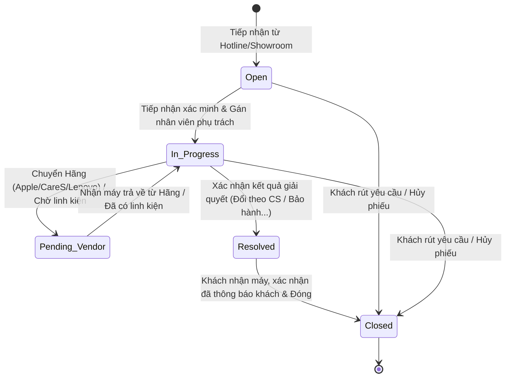
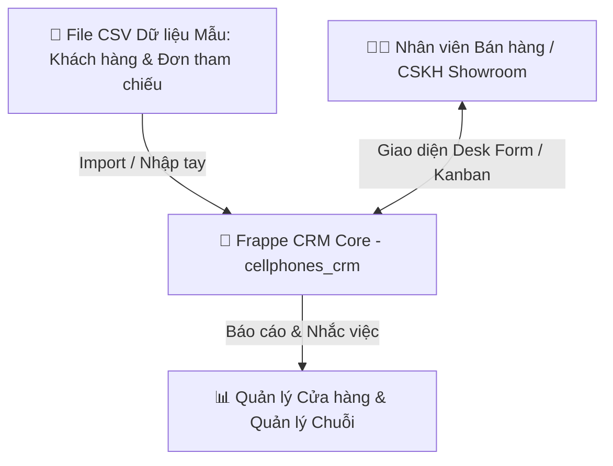

# SẢN PHẨM BÀN GIAO D04: BẢNG ÁNH XẠ THIẾT KẾ SANG FRAPPE FRAMEWORK
## MODULE CRM CHUỖI BÁN LẺ CÔNG NGHỆ CELLPHONES (TRÊN FRAPPE FRAMEWORK)

**Mã sản phẩm:** D04  
**Thuộc nhiệm vụ:** Nhiệm vụ 5 (Bảng ánh xạ mô hình sang Frappe Framework)  
**Tác giả:** Trần Quang Huy (System Analyst & Project Manager)  
**Nền tảng mục tiêu:** Frappe Framework v15.x / ERPNext v15.x (MariaDB 10.6+ / PostgreSQL 15+)  
**Trạng thái:** Hoàn thiện Mốc M4 (Final Deliverable)

> [!NOTE]
> **Ghi chú thiết kế:** Đây là mô hình ánh xạ kỹ thuật đề xuất (Proposed Mapping Model) phục vụ triển khai cấu hình DocType, Workflow, Phân quyền và Tích hợp trên nền tảng Frappe Framework v15, được thiết kế tối ưu giữa việc kế thừa các thành phần sẵn có của ERPNext và xây dựng ứng dụng tùy biến riêng biệt (`cellphones_crm`).

---

## PHẦN 1: CHỐT PHIÊN BẢN & KIẾN TRÚC ỨNG DỤNG SỬ DỤNG

* **Nền tảng Core:** **Frappe Framework v15.x** kết hợp hệ sinh thái **ERPNext v15.x**.
* **Ứng dụng triển khai:** Custom App mang tên **`cellphones_crm`** được tạo thông qua lệnh `bench new-app cellphones_crm`.
* **Cơ sở dữ liệu:** MariaDB 10.6+ (hoặc PostgreSQL 15+).
* **Mô hình kiến trúc:**
  * **Ứng dụng tùy biến (`cellphones_crm`):** Chứa các Custom DocTypes chuyên biệt cho bán lẻ công nghệ (Smember, Interaction, Support Ticket, Repair Items, Merge Logs).
  * **Kế thừa ERPNext Standard Modules:** Tận dụng `CRM`, `Selling`, `Support`, `Stock`, `Core` để tránh phát minh lại bánh xe cho các thực thể Khách hàng (`Customer`), Khách tiềm năng (`Lead`), Sản phẩm (`Item`) và Người dùng (`User`).

---

## PHẦN 2: BẢNG ÁNH XẠ DOCTYPE TOÀN DIỆN (DOCTYPE MAPPING SPECIFICATION)

Dưới đây là bảng phân định chi tiết giữa thành phần sẵn có kế thừa từ ERPNext và thành phần tự xây dựng trong app `cellphones_crm`:

| Thực thể Logic (ERD) | DocType trong Frappe | Phân loại thành phần | Module Frappe | Naming Series / Sinh mã | Ý nghĩa nghiệp vụ trong hệ sinh thái CellphoneS |
| :--- | :--- | :---: | :--- | :--- | :--- |
| **Khách hàng** (`CUSTOMER`) | `Customer` | **SẴN CÓ** *(Thêm Custom Fields)* | `CRM` / `Selling` | `CUST-.YYYY.-.#####` | Định danh khách hàng nội bộ duy nhất, lưu thông tin liên hệ (SĐT), 4 hạng Smember và nhóm giáo dục. |
| **Chi nhánh Cửa hàng** (`BRANCH_STORE`) | `Branch` *(hoặc `Branch Store`)* | **SẴN CÓ / MỞ RỘNG** | `Core` / `CRM` | `BR-.#####` | Quản lý mạng lưới Showroom mô phỏng (`BR-00101`, `BR-00102`) và Trung tâm tiếp nhận bảo hành/CareS (`BR-00201`). |
| **Cơ hội / Nhu cầu** (`LEAD_OPPORTUNITY`) | `Lead` *(hoặc `Opportunity`)* | **SẴN CÓ** *(Thêm Custom Fields)* | `CRM` | `LEAD-.YYYY.-.#####` | Tiếp nhận nhu cầu tư vấn (Lenovo LOQ, iPhone 15 Pro Max, sạc GaN), ngân sách, cấu hình và lịch nhắc việc 3 ngày. |
| **Tương tác Đa kênh** (`CUSTOMER_INTERACTION`) | `Customer Interaction` | **TỰ XÂY** *(Custom DocType)* | `CellphoneS CRM` | `INT-.YYYY.-.#####` | Ghi nhận nhật ký tiếp xúc từ Tổng đài Hotline 1800, Zalo OA, Fanpage và Showroom. |
| **Phiếu hỗ trợ** (`SUPPORT_TICKET`) | `Support Ticket` *(hoặc `Issue`)* | **TỰ XÂY** *(Custom DocType)* | `CellphoneS CRM` | `TCK-.YYYY.-.#####` | Tiếp nhận bảo hành, đổi trả theo chính sách, điều phối xử lý, ghi nhận kết quả và trạng thái thông báo khách. |
| **Đơn hàng tham chiếu** (`SALES_INVOICE_REF`) | `Sales Invoice Reference` | **TỰ XÂY** *(Custom DocType)* | `CellphoneS CRM` | `INV-.YYYY.-.#####` | Tham chiếu đơn hàng/hóa đơn bán ra nạp từ CSV, lưu IMEI/Serial để đối chiếu chính sách hậu mãi. |
| **Chi tiết linh kiện** (`TICKET_REPAIR_ITEM`) | `Ticket Repair Item` | **TỰ XÂY** *(Child DocType)* | `CellphoneS CRM` | `autoincrement` | Bảng con (`istable = 1`) nhúng trong Ticket để ghi nhận linh kiện tiếp nhận và ngoại quan máy. |
| **Nhật ký xử lý phiếu** (`TICKET_ACTIVITY_LOG`) | `Ticket Activity Log` | **TỰ XÂY** *(Child DocType)* | `CellphoneS CRM` | `autoincrement` | Bảng con (`istable = 1`) lưu vết chuyển trạng thái, ghi chú xác minh và hành động chăm sóc. |
| **Sản phẩm tham chiếu** (`ITEM_REFERENCE`) | `Item` | **SẴN CÓ** *(CRM Reference)* | `Stock` | `SP-.#####` | Danh mục SKU đại diện nghiên cứu (`SP-LOQ-83GS001RVN`, `SP-IP15PM-256`, `SP-GAN-65W`) và thời hạn bảo hành. |
| **Người dùng / Nhân sự** (`STAFF_USER`) | `User` | **SẴN CÓ** | `Core` | `user@cellphones.com.vn`| Định danh tài khoản phân quyền 5 nhóm vai trò nội bộ trong chuỗi. |

---

## PHẦN 3: ĐẶC TẢ KIỂU TRƯỜNG & LIÊN KẾT TRONG FRAPPE (FIELD TYPES & RELATIONS)

### 1. Phân định Cơ chế Quan hệ Dữ liệu trên Frappe:
* **Quan hệ 1 - N (One-to-Many):** Sử dụng kiểu trường `Link` trỏ tới Master DocType (Ví dụ: Trong `Support Ticket`, trường `customer` kiểu `Link` trỏ tới `Customer`).
* **Quan hệ Bảng con (Master - Detail / Child Table):** Sử dụng kiểu trường `Table` trỏ tới `Child DocType` (có thuộc tính `Is Child Table = 1`). Khi xóa bản ghi cha, toàn bộ dòng con tự động bị xóa theo (Cascade Delete).
* **Quan hệ 1 - 1 (One-to-One):** Sử dụng trường `Link` kết hợp thuộc tính `Unique = 1` hoặc lưu trực tiếp dưới dạng Custom Field trên Master DocType `Customer`.

### 2. Chi tiết Ánh xạ Trường trong DocType cốt lõi `Support Ticket`:

| Tên trường Form UI | Fieldname (Kỹ thuật) | Fieldtype (Frappe) | Options / Target Link | Mandatory | Ràng buộc nghiệp vụ / Fetch From |
| :--- | :--- | :--- | :--- | :---: | :--- |
| **Mã phiếu** | `name` | `Data` | Naming Series: `TCK-.YYYY.-.#####` | Yes | Tự động sinh khi tạo phiếu |
| **Khách hàng** | `customer` | `Link` | `Customer` | No | Nullable (Hỗ trợ Khách vãng lai `CUST-GUEST`) |
| **Số điện thoại** | `contact_phone` | `Data` | Regex: `^(0[3\|5\|7\|8\|9])[0-9]{8}$` | Yes | Tự động điền nếu chọn Khách hàng |
| **Họ tên người liên hệ**| `contact_name` | `Data` | — | Yes | Tự động điền nếu chọn Khách hàng |
| **Hạng Smember** | `smember_tier` | `Data` | Fetch From: `customer.custom_smember_tier`| No | Read Only (`S-NULL`, `S-NEW`, `S-MEM`, `S-VIP`) |
| **Kênh tiếp nhận** | `channel` | `Select` | `Hotline\nShowroom\nZalo_OA\nWebsite` | Yes | Mặc định: `Showroom` |
| **Chi nhánh tiếp nhận**| `branch` | `Link` | `Branch` | Yes | Mặc định lấy Showroom của nhân viên đăng nhập |
| **Mã sản phẩm** | `item_code` | `Link` | `Item` | Yes | Lọc theo danh mục hàng hóa nghiên cứu |
| **Tên sản phẩm** | `item_name` | `Data` | Fetch From: `item_code.item_name` | No | Read Only |
| **Số Serial / IMEI** | `serial_imei` | `Data` | — | No | Bắt buộc đối với điện thoại/laptop có IMEI |
| **Hóa đơn tham chiếu** | `sales_invoice` | `Link` | `Sales Invoice Reference` | No | Dùng đối soát thời hạn và chính sách đổi trả |
| **Nhóm vấn đề** | `issue_category`| `Select` | `Tiep_nhan_bao_hanh\nDoi_tra_theo_chinh_sach\nKhieu_nai_dich_vu\nHo_tro_ky_thuat`| Yes | Quyết định điều phối xử lý |
| **Mức độ ưu tiên** | `priority` | `Select` | `Low\nMedium\nHigh\nCritical` | Yes | Tự động nâng lên nếu khách là `S-VIP` |
| **Trạng thái phiếu** | `status` | `Select` | `Open\nIn_Progress\nPending_Vendor\nResolved\nClosed` | Yes | 5 trạng thái đồng bộ State Diagram C03 |
| **Người phụ trách** | `allocated_to` | `Link` | `User` | No | Phân công nhân viên tiếp nhận/xử lý |
| **Đơn vị phối hợp** | `partner_unit` | `Select` | `CSKH_Showroom\nTrung_tam_Dien_Thoai_Vui\nTrung_tam_CareS\nHang_Apple\nHang_Lenovo` | Yes | Mặc định: `CSKH_Showroom` |
| **Kết quả giải quyết** | `resolution_result`| `Select` | `Bao_hanh_chinh_hang\nDoi_theo_chinh_sach\nSua_chua_co_phi\nKhong_du_dieu_kien\nKhach_rut_yeu_cau` | No | Bắt buộc khi chuyển `Resolved` |
| **Ghi chú xử lý** | `resolution_notes`| `Small Text` | — | No | Bắt buộc khi chuyển `Resolved`/`Closed` |
| **Trạng thái báo khách**| `notify_customer_status`| `Select` | `Chua_thong_bao\nDa_thong_bao_qua_dien_thoai\nDa_thong_bao_tai_quay` | Yes | Ghi nhận thông báo khách (MVP Rule) |
| **Thời điểm báo khách**| `customer_notified_at`| `Datetime` | — | No | Lưu thời gian hoàn tất thông báo |
| **Bảng linh kiện lỗi** | `repair_items` | `Table` | `Ticket Repair Item` | No | Bảng con chi tiết tình trạng máy |
| **Nhật ký hoạt động** | `activity_logs` | `Table` | `Ticket Activity Log` | No | Bảng con lưu vết trao đổi/chuyển trạng thái |

---

## PHẦN 4: THIẾT KẾ QUY TRÌNH WORKFLOW (5 STATES & TRANSITION RULES)

Quy trình xử lý Phiếu hỗ trợ được cấu hình thông qua **Frappe Workflow Engine**, đảm bảo 100% đồng nhất với State Diagram C03 của Nhật:

### Bảng Cấu hình Workflow Transitions & Điều kiện Kiểm tra:

| Trạng thái hiện tại (`State`) | Hành động (`Action`) | Trạng thái kế tiếp (`Next State`) | Vai trò được phép (`Allowed Role`) | Điều kiện kiểm tra kỹ thuật (`Validation Condition`) |
| :--- | :--- | :--- | :--- | :--- |
| **Open** (Mới tạo) | `Start Processing` | **In_Progress** | Bán hàng và CSKH cửa hàng, Quản lý cửa hàng, CSKH cấp chuỗi | Đã gán `allocated_to` (Người phụ trách không được để trống). |
| **In_Progress** (Đang xử lý) | `Send to Vendor` | **Pending_Vendor** | Bán hàng và CSKH cửa hàng, Quản lý cửa hàng, CSKH cấp chuỗi | Bắt buộc chọn Đơn vị phối hợp (`partner_unit`). |
| **Pending_Vendor** (Chờ hãng/LK)| `Receive from Vendor` | **In_Progress** | Bán hàng và CSKH cửa hàng, Quản lý cửa hàng, CSKH cấp chuỗi | Ghi nhận máy trả về vào `Ticket_Activity_Log`. |
| **In_Progress** (Đang xử lý) | `Mark Resolved` | **Resolved** | Bán hàng và CSKH cửa hàng, Quản lý cửa hàng, CSKH cấp chuỗi | **Bắt buộc:** `resolution_result` và `resolution_notes` không được để trống. |
| **Resolved** (Đã giải quyết) | `Notify & Close` | **Closed** | Bán hàng và CSKH cửa hàng, Quản lý cửa hàng, CSKH cấp chuỗi | **Bắt buộc:** `notify_customer_status` $\neq$ `Chua_thong_bao`. |
| **Open / In_Progress** | `Cancel / Withdraw` | **Closed** | Quản lý cửa hàng, Quản lý chuỗi, CSKH cấp chuỗi | Bắt buộc ghi nhận lý do rút yêu cầu hoặc hủy phiếu. |

---

## PHẦN 5: MA TRẬN PHÂN QUYỀN (ROLE PERMISSION MATRIX & USER PERMISSIONS)

Frappe Framework kiểm soát truy cập dựa trên **5 Nhóm Vai trò Nội bộ** và cơ chế **User Permissions** theo Chi nhánh Cửa hàng:

| DocType | Vai trò người dùng (`Role`) | Đọc (`Read`) | Tạo (`Create`) | Sửa (`Write`) | Xóa (`Delete`) | Xuất (`Export`) | Quyền đặc biệt / Phân vùng dữ liệu (`User Permissions`) |
| :--- | :--- | :---: | :---: | :---: | :---: | :---: | :--- |
| **`Customer`** | Bán hàng và CSKH cửa hàng | ✅ | ✅ | ✅ | ❌ | ❌ | Xem/sửa thông tin liên hệ; không sửa Hạng & Giáo dục. |
| | Quản lý cửa hàng | ✅ | ✅ | ✅ | ❌ | ❌ | Quản lý khách hàng thuộc phạm vi Showroom. |
| | CSKH cấp chuỗi | ✅ | ✅ | ✅ | ❌ | ❌ | Xem khách hàng trên toàn chuỗi; hỗ trợ điều chuyển. |
| | Quản lý chuỗi | ✅ | ❌ | ❌ | ❌ | ✅ | Xem toàn chuỗi phục vụ phân tích báo cáo. |
| | Quản trị hệ thống | ✅ | ✅ | ✅ | ✅ | ✅ | Toàn quyền; được cập nhật Hạng & Nhóm giáo dục. |
| **`Lead` (Cơ hội)** | Bán hàng và CSKH cửa hàng | ✅ | ✅ | ✅ | ❌ | ❌ | Quản lý cơ hội được phân công tại cửa hàng được cấp. |
| | Quản lý cửa hàng | ✅ | ✅ | ✅ | ❌ | ❌ | Phân công và điều chuyển cơ hội trong phạm vi cửa hàng. |
| | CSKH cấp chuỗi | ✅ | ✅ | ✅ | ❌ | ❌ | Điều chuyển cơ hội giữa các cửa hàng trên toàn chuỗi. |
| | Quản lý chuỗi | ✅ | ❌ | ❌ | ❌ | ✅ | Xem báo cáo tổng hợp cơ hội và tỷ lệ thắng của chuỗi. |
| | Quản trị hệ thống | ✅ | ✅ | ✅ | ✅ | ✅ | Toàn quyền cấu hình và quản trị cơ hội. |
| **`Support Ticket`** | Bán hàng và CSKH cửa hàng | ✅ | ✅ | ✅ | ❌ | ❌ | Mở phiếu, cập nhật xử lý và thông báo khách tại cửa hàng. |
| | Quản lý cửa hàng | ✅ | ✅ | ✅ | ❌ | ❌ | Phân công và điều chuyển ticket trong phạm vi cửa hàng. |
| | CSKH cấp chuỗi | ✅ | ✅ | ✅ | ❌ | ❌ | Điều chuyển ticket giữa các Showroom và đơn vị bảo hành. |
| | Quản lý chuỗi | ✅ | ❌ | ❌ | ❌ | ✅ | Xem báo cáo tổng hợp ticket và tiến độ toàn chuỗi. |
| | Quản trị hệ thống | ✅ | ✅ | ✅ | ✅ | ✅ | Toàn quyền quản trị hệ thống phiếu hỗ trợ. |
| **`Customer Interaction`**| Bán hàng và CSKH cửa hàng | ✅ | ✅ | ✅ | ❌ | ❌ | Ghi nhận tương tác tại quầy Showroom hoặc gọi điện. |
| | Quản lý cửa hàng | ✅ | ✅ | ✅ | ❌ | ❌ | Giám sát lịch sử tương tác của cửa hàng. |
| | CSKH cấp chuỗi | ✅ | ✅ | ✅ | ❌ | ❌ | Ghi nhận tương tác đa kênh (Hotline, Zalo, Web) toàn chuỗi. |
| | Quản lý chuỗi | ✅ | ❌ | ❌ | ❌ | ✅ | Xem báo cáo thống kê tương tác theo kênh. |
| | Quản trị hệ thống | ✅ | ✅ | ✅ | ✅ | ✅ | Toàn quyền nhật ký tương tác. |
| **`Sales Invoice Reference`**| Bán hàng và CSKH cửa hàng| ✅ | ❌ | ❌ | ❌ | ❌ | Tra cứu hóa đơn/đơn hàng tham chiếu để đối soát. |
| | Quản lý cửa hàng | ✅ | ❌ | ❌ | ❌ | ❌ | Tra cứu đơn hàng phục vụ xử lý khiếu nại tại quầy. |
| | CSKH cấp chuỗi | ✅ | ❌ | ❌ | ❌ | ❌ | Tra cứu đơn hàng toàn chuỗi khi tiếp nhận bảo hành. |
| | Quản lý chuỗi | ✅ | ❌ | ❌ | ❌ | ✅ | Xem dữ liệu đơn hàng tham chiếu phục vụ báo cáo. |
| | Quản trị hệ thống | ✅ | ✅ | ✅ | ✅ | ✅ | Nạp dữ liệu CSV đơn hàng tham chiếu vào hệ thống. |

---

## PHẦN 6: DỮ LIỆU THAM CHIẾU NGOÀI & PHƯƠNG ÁN MÔ PHỎNG (INTEGRATION & SIMULATION)

Nhằm đảm bảo hệ thống CRM CellphoneS hoạt động chuẩn xác trong phạm vi nghiên cứu mô phỏng cấp chuỗi (2 Showroom):

### 1. Phân định Phạm vi Xử lý Dữ liệu trong MVP

1. **Dữ liệu Đơn hàng & Hóa đơn Tham chiếu:**
   * Dữ liệu được nạp vào CRM thông qua file CSV định kỳ (`Sales_Invoice_Reference`) hoặc nhập tay khi tiếp nhận khách. CRM không can thiệp vào nghiệp vụ kế toán, xuất/nhập kho hay tạo Credit Note hoàn tiền thực tế.
2. **Quy tắc Thông báo Khách hàng:**
   * Trong giai đoạn thử nghiệm MVP, CRM chưa tích hợp cổng gửi tin nhắn tự động SMS/Zalo ZNS trực tiếp. Nhân viên CSKH trực tiếp thực hiện gọi điện/thông báo tại quầy và ghi nhận vào trường `notify_customer_status`.
3. **Mô phỏng Dữ liệu Kiểm thử Nghiệp vụ:**
   * Sử dụng bộ dữ liệu mẫu 500 khách hàng và 1.000 đơn tham chiếu nạp qua CSV để kiểm thử hiệu năng, ma trận phân quyền giữa 2 Showroom và quy tắc tính báo cáo tỷ lệ thắng.

