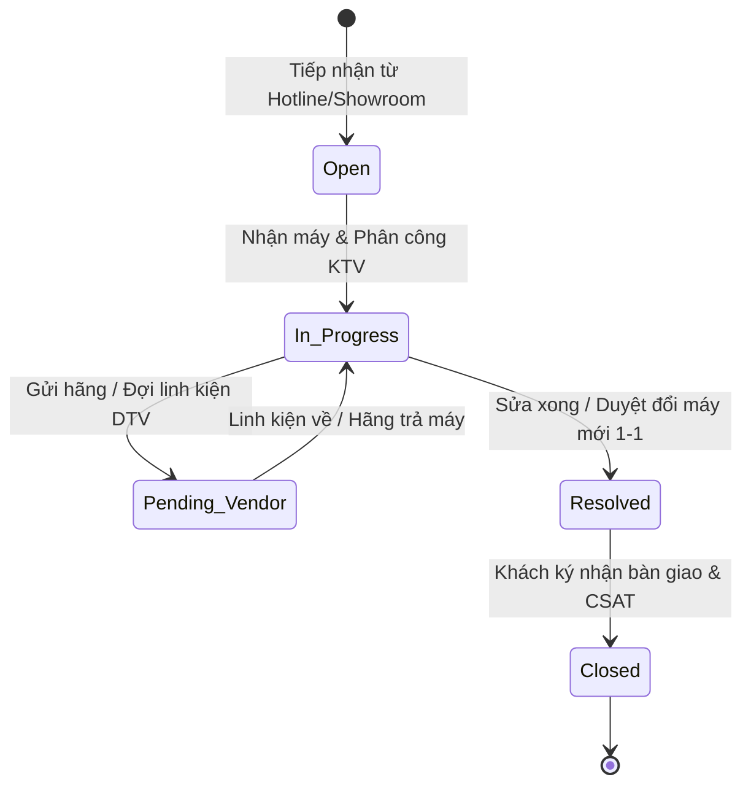

# SẢN PHẨM BÀN GIAO D04: BẢNG ÁNH XẠ THIẾT KẾ SANG FRAPPE FRAMEWORK
## MODULE CRM CHUỖI BÁN LẺ CÔNG NGHỆ CELLPHONES (TRÊN FRAPPE FRAMEWORK)

**Mã sản phẩm:** D04  
**Thuộc nhiệm vụ:** Nhiệm vụ 5 (Bảng ánh xạ mô hình sang Frappe Framework)  
**Tác giả:** Trần Quang Huy (System Analyst & Project Manager)  
**Trạng thái:** Bản nháp Mốc M3 (Draft for Cross-check)

> [!NOTE]
> **Ghi chú thiết kế:** Đây là mô hình ánh xạ kỹ thuật đề xuất (Proposed Mapping Model) phục vụ triển khai cấu hình DocType, Workflow và Phân quyền trên Frappe Framework v15, chưa phải là cấu trúc vật lý đã cố định trên hệ thống cơ sở dữ liệu production.

---

## PHẦN 1: BẢNG ÁNH XẠ DOCTYPE (DOCTYPE MAPPING SPECIFICATION)

Frappe Framework quản lý toàn bộ thực thể dưới dạng **DocType**. Dưới đây là bảng chuyển đổi từ Mô hình ERD Logic sang các thành phần kỹ thuật của Frappe:

| Thực thể Logic (ERD) | DocType trong Frappe | Loại DocType (Standard / Custom) | Module Frappe | Quy tắc sinh mã tự động (Naming Series) | Ý nghĩa nghiệp vụ trong hệ sinh thái CellphoneS |
| :--- | :--- | :--- | :--- | :--- | :--- |
| **Khách hàng** (`Customer`) | `Customer` | **Standard** (Bổ sung Custom Fields) | `CRM` / `Selling` | `CUST-.YYYY.-.#####` | Kế thừa DocType chuẩn của ERPNext, mở rộng liên kết với hồ sơ Smember. |
| **Hồ sơ Hội viên Smember** (`Smember_Profile`) | `Smember Profile` | **Custom DocType** (Single/Master) | `CellphoneS CRM` | `SMB-.#####` | Quản lý hạng thẻ Smember/S-VIP, dồn tích lũy và điều chỉnh điểm thưởng. |
| **Nhu cầu Tư vấn / Pre-order** (`Lead_Opportunity`) | `Lead` | **Standard** (Bổ sung Custom Fields) | `CRM` | `LEAD-.YYYY.-.#####` | Quản lý khách đặt trước iPhone/Samsung Flagship và nhu cầu trả góp từ Telesales. |
| **Tương tác Đa kênh** (`Customer_Interaction`) | `Customer Interaction` | **Custom DocType** | `CellphoneS CRM` | `INT-.YYYY.-.#####` | Nhật ký tiếp xúc từ Hotline tổng đài, Chat Zalo OA, Fanpage và Showroom. |
| **Phiếu hỗ trợ** (`Support_Ticket`) | `Support Ticket` *(hoặc `Issue`)* | **Custom DocType** | `CellphoneS CRM` | `TCK-.YYYY.-.#####` | Tiếp nhận bảo hành, khiếu nại chất lượng, điều phối sửa chữa Điện Thoại Vui. |
| **Chi tiết Linh kiện kiểm tra** (`Ticket_Repair_Item`) | `Ticket Repair Item` | **Child DocType** (`istable = 1`) | `CellphoneS CRM` | `autoincrement` | Bảng con nhúng trong Ticket để lưu danh sách lỗi linh kiện và ngoại quan máy. |
| **Nhật ký Xử lý Phiếu** (`Ticket_Activity_Log`) | `Ticket Activity Log` | **Child DocType** (`istable = 1`) | `CellphoneS CRM` | `autoincrement` | Bảng con lưu vết trao đổi nội bộ giữa Showroom và Kỹ thuật viên Điện Thoại Vui. |
| **Sản phẩm tham chiếu** (`Item_Reference`) | `Item` | **Standard** (CRM Reference) | `Stock` | `SP-.#####` | Danh mục SKU, tên thiết bị, tra cứu thời hạn bảo hành gốc. |
| **Người dùng / Nhân sự** (`Staff_User`) | `User` | **Standard** | `Core` | `user@cellphones.com.vn` | Định danh tài khoản CSKH Agent, Kỹ thuật DTV, Quản lý CSKH. |
| **Lịch sử Gộp Hồ sơ** (`Customer_Merge_Log`) | `Customer Merge Log` | **Custom DocType** | `CellphoneS CRM` | `MRG-.YYYY.-.#####` | Lưu vết kiểm toán các phiên gộp hồ sơ trùng lặp. |

---

## PHẦN 2: ĐẶC TẢ KIỂU TRƯỜNG & LIÊN KẾT TRONG FRAPPE (FIELD TYPES & RELATIONS)

### 1. Phân định Cơ chế Quan hệ Dữ liệu:
* **Quan hệ 1 - N (One-to-Many):** Sử dụng kiểu trường `Link` kèm bộ lọc `Link Filters`. Ví dụ: Trong `Support Ticket`, trường `customer` kiểu `Link` trỏ tới `Customer`.
* **Quan hệ Bảng con (Master - Detail / Child Table):** Sử dụng kiểu trường `Table` trỏ tới `Child DocType` (có cờ `Is Child Table`). Khi xóa bản ghi cha, các dòng bảng con tự động được thu hồi (Cascade Delete).
* **Quan hệ 1 - 1 (One-to-One):** Sử dụng trường `Link` kết hợp thuộc tính `Unique = 1` (Ví dụ: `Smember Profile.customer` liên kết duy nhất với một `Customer`).

### 2. Chi tiết Ánh xạ Trường trong DocType cốt lõi `Support Ticket`:

| Tên trường trên Form | Fieldname (Kỹ thuật) | Fieldtype (Frappe) | Options / Target Link | Mandatory | Ràng buộc nghiệp vụ / Fetch From |
| :--- | :--- | :--- | :--- | :---: | :--- |
| **Mã phiếu** | `name` | `Data` | Naming Series: `TCK-.YYYY.-.#####` | Yes | Tự động sinh khi tạo phiếu |
| **Khách hàng** | `customer` | `Link` | `Customer` | No | Nullable (Hỗ trợ Khách vãng lai `CUST-GUEST`) |
| **Số điện thoại** | `contact_phone` | `Data` | Regex: `^(0[3\|5\|7\|8\|9])[0-9]{8}$` | Yes | Tự động điền nếu chọn Khách hàng |
| **Họ tên người liên hệ**| `contact_name` | `Data` | — | Yes | Tự động điền nếu chọn Khách hàng |
| **Hạng Smember** | `smember_tier` | `Data` | Fetch From: `customer.custom_smember_tier`| No | Read Only (Hiển thị Badge VIP) |
| **Kênh tiếp nhận** | `channel` | `Select` | `Hotline\nShowroom\nZalo_OA\nWebsite` | Yes | Mặc định: `Showroom` |
| **Mã sản phẩm** | `item_code` | `Link` | `Item` | Yes | Lọc theo danh mục hàng hóa CellphoneS |
| **Tên sản phẩm** | `item_name` | `Data` | Fetch From: `item_code.item_name` | No | Read Only |
| **Số Serial / IMEI** | `serial_imei` | `Data` | Regex: `^[0-9]{15}$` | Yes | 15 số chuẩn GSMA, kiểm tra Luhn |
| **Nhóm vấn đề** | `issue_category`| `Select` | `Loi_phan_cung\nDoi_tra_30_ngay_VIP\nKhieu_nai_dich_vu`| Yes | Quyết định điều phối phòng ban |
| **Mức độ ưu tiên** | `priority` | `Select` | `Low\nMedium\nHigh\nCritical` | Yes | Tự động nâng lên `High` nếu là khách S-VIP |
| **Trạng thái phiếu** | `workflow_state` | `Link` | `Workflow State` | Yes | Điều khiển bởi Workflow Engine |
| **Nhân viên phụ trách**| `allocated_to` | `Link` | `User` | No | Phân công kỹ thuật viên xử lý |
| **Đơn vị xử lý** | `assigned_dept` | `Select` | `CSKH_Showroom\nTrung_tam_Dien_Thoai_Vui\nHang_Apple\nHang_Samsung` | Yes | Mặc định: `CSKH_Showroom` |
| **Hạn chót SLA** | `sla_deadline` | `Datetime` | — | Yes | Server script tính toán tự động |
| **Bảng linh kiện lỗi** | `repair_items` | `Table` | `Ticket Repair Item` | No | Bảng con chi tiết tình trạng máy |
| **Phương án giải quyết**| `resolution_type`| `Select` | `Doi_may_moi_100\nSua_chua_thay_linh_kien\nBao_hanh_hang\nTu_choi` | No | Bắt buộc khi chuyển trạng thái `Resolved` |
| **Báo cáo nguyên nhân** | `root_cause` | `Small Text` | — | No | Bắt buộc khi chuyển trạng thái `Resolved` |
| **Ghi chú khắc phục** | `resolution_notes`| `Small Text` | — | No | Bắt buộc khi chuyển trạng thái `Closed` |
| **Điểm CSAT** | `csat_score` | `Select` | `1_Sao\n2_Sao\n3_Sao\n4_Sao\n5_Sao` | No | Ghi nhận từ Webhook Zalo ZNS |

---

## PHẦN 3: THIẾT KẾ QUY TRÌNH WORKFLOW (5 STATES & TRANSITION RULES)

Quy trình xử lý Phiếu hỗ trợ được cấu hình thông qua **Frappe Workflow Engine**, đảm bảo 100% đồng nhất với State Diagram của Nhật:

### Bảng Cấu hình Workflow Transitions (Chuyển đổi Trạng thái & Phân quyền):

| Trạng thái hiện tại (`State`) | Hành động (`Action`) | Trạng thái kế tiếp (`Next State`) | Vai trò được phép (`Allowed Role`) | Điều kiện kiểm tra kỹ thuật (`Validation Condition`) |
| :--- | :--- | :--- | :--- | :--- |
| **Open** (Mới tạo) | `Assign / Start Work` | **In_Progress** | CSKH Agent, CSKH Manager, KTV Điện Thoại Vui | Đã gán `allocated_to` (Nhân viên phụ trách không được để trống). |
| **In_Progress** (Đang xử lý) | `Send to Vendor` | **Pending_Vendor** | KTV Điện Thoại Vui, CSKH Manager | Bắt buộc nhập ít nhất 1 dòng trong bảng con `repair_items`. |
| **Pending_Vendor** (Chờ hãng/LK)| `Receive from Vendor` | **In_Progress** | KTV Điện Thoại Vui, CSKH Manager | Ghi nhận thời điểm nhận linh kiện về trung tâm DTV. |
| **In_Progress** (Đang xử lý) | `Mark Resolved` | **Resolved** | KTV Điện Thoại Vui, CSKH Manager | **Bắt buộc:** `resolution_type` và `root_cause` không được để trống. |
| **Resolved** (Đã giải quyết) | `Customer Accept & Close`| **Closed** | CSKH Agent, CSKH Manager | **Bắt buộc:** `resolution_notes` không được trống. Kích hoạt Webhook Zalo ZNS. |
| **Open / In_Progress** | `Cancel Ticket` | **Closed** | CSKH Manager | Chỉ Quản lý mới có quyền hủy phiếu (bắt buộc nhập lý do hủy). |

---

## PHẦN 4: MA TRẬN PHÂN QUYỀN (ROLE PERMISSION MANAGER)

Frappe Framework kiểm soát truy cập dựa trên **Roles** và **Permission Levels** (Cấp độ trường). Dưới đây là ma trận phân quyền chi tiết cho 4 nhóm người dùng trong hệ sinh thái CellphoneS:

| DocType | Vai trò người dùng (`Role`) | Đọc (`Read`) | Tạo (`Create`) | Sửa (`Write`) | Xóa (`Delete`) | Xuất (`Export`) | Quyền đặc biệt / Phân vùng dữ liệu (`User Permissions`) |
| :--- | :--- | :---: | :---: | :---: | :---: | :---: | :--- |
| **`Customer`** | CSKH Agent | ✅ | ✅ | ✅ | ❌ | ❌ | Xem và sửa khách hàng trên toàn hệ thống. |
| | CSKH Manager | ✅ | ✅ | ✅ | ✅ | ✅ | Toàn quyền, thực thi chức năng Gộp hồ sơ (Merge). |
| | Kỹ thuật viên DTV | ✅ | ❌ | ❌ | ❌ | ❌ | Chỉ xem thông tin liên hệ và lịch sử máy. |
| | Nhân viên Showroom | ✅ | ✅ | ✅ | ❌ | ❌ | Tạo khách mới và cập nhật địa chỉ lúc bán hàng. |
| **`Smember Profile`**| CSKH Agent | ✅ | ❌ | ❌ | ❌ | ❌ | Chỉ đọc hạng thành viên và điểm tích lũy. |
| | CSKH Manager | ✅ | ✅ | ✅ | ❌ | ✅ | Duyệt cộng/trừ điểm thưởng thủ công. |
| | Kỹ thuật viên DTV | ✅ | ❌ | ❌ | ❌ | ❌ | Chỉ đọc để nhận biết khách VIP. |
| | Nhân viên Showroom | ✅ | ❌ | ❌ | ❌ | ❌ | Chỉ đọc để áp dụng chiết khấu Smember. |
| **`Support Ticket`**| CSKH Agent | ✅ | ✅ | ✅ | ❌ | ❌ | Tạo phiếu, cập nhật tiếp nhận, đóng phiếu khi giao máy. |
| | CSKH Manager | ✅ | ✅ | ✅ | ✅ | ✅ | Toàn quyền, ghi đè trạng thái, duyệt đổi máy mới 1-1. |
| | Kỹ thuật viên DTV | ✅ | ❌ | ✅ | ❌ | ❌ | Sửa các trường chẩn đoán lỗi và cập nhật bảng linh kiện. |
| | Nhân viên Showroom | ✅ | ✅ | ❌ | ❌ | ❌ | Mở phiếu tiếp nhận máy tại quầy Showroom. |
| **`Customer Interaction`**| CSKH Agent | ✅ | ✅ | ✅ | ❌ | ❌ | Ghi nhận nhật ký cuộc gọi Hotline / Zalo chat. |
| | CSKH Manager | ✅ | ✅ | ✅ | ✅ | ✅ | Giám sát toàn bộ nhật ký tương tác và chỉ số CSAT. |
| | Kỹ thuật viên DTV | ✅ | ❌ | ❌ | ❌ | ❌ | Xem lịch sử tương tác trước đó của khách. |
| | Nhân viên Showroom | ✅ | ✅ | ❌ | ❌ | ❌ | Ghi nhận tương tác trực tiếp tại cửa hàng. |

---

## PHẦN 5: KIỂM TRA ĐỘ KHỚP NỐI & TÍNH KHẢ THI KỸ THUẬT

1. **Khớp nối với Wireframe (D03):** Các nút bấm trên màn hình (Ví dụ: `Nhận xử lý`, `Chuyển Hãng`, `Hoàn tất`, `Đóng phiếu`) tương ứng chính xác với các `Action` trong bảng Workflow Transition.
2. **Khớp nối với Từ điển Dữ liệu (D02):** 100% Fieldname kỹ thuật của Frappe khớp với cột `Physical Name` trong từ điển D02.
3. **Tuân thủ Chuẩn Frappe:** Tách biệt rõ giữa Standard DocType kế thừa và Custom DocType mở rộng, sử dụng Child DocType cho dữ liệu lặp, đảm bảo khả năng nâng cấp phiên bản Frappe Framework mà không bị xung đột mã nguồn.
