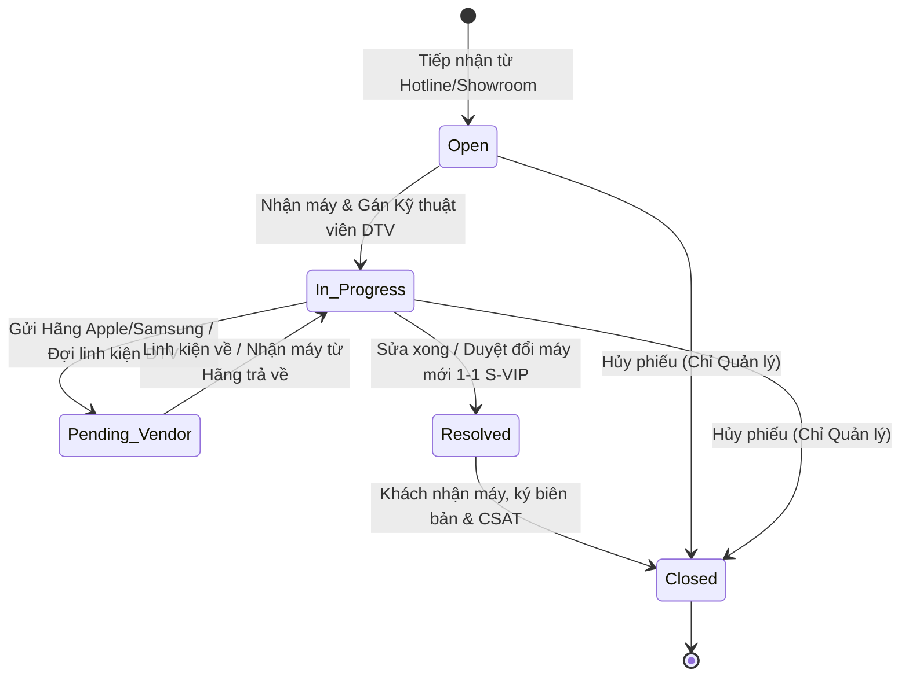
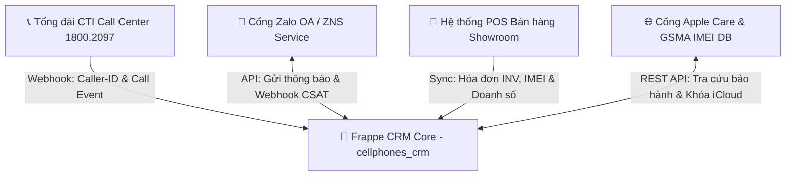

# SẢN PHẨM BÀN GIAO D04: BẢNG ÁNH XẠ THIẾT KẾ SANG FRAPPE FRAMEWORK
## MODULE CRM CHUỖI BÁN LẺ CÔNG NGHỆ CELLPHONES (TRÊN FRAPPE FRAMEWORK)

**Mã sản phẩm:** D04  
**Thuộc nhiệm vụ:** Nhiệm vụ 5 (Bảng ánh xạ mô hình sang Frappe Framework)  
**Tác giả:** Trần Quang Huy (System Analyst & Project Manager)  
**Nền tảng mục tiêu:** Frappe Framework v15.x / ERPNext v15.x (MariaDB 10.6+ / PostgreSQL 15+)  
**Trạng thái:** Hoàn thiện Mốc M4 (Final Deliverable)

> [!NOTE]
> **Ghi chú thiết kế:** Đây là mô hình ánh xạ kỹ thuật đề xuất (Proposed Mapping Model) phục vụ triển khai cấu hình DocType, Workflow, Phân quyền và Tích hợp trên nền tảng Frappe Framework v15, được thiết kế tối ưu giữa việc kế thừa các thành phần sẵn có của ERPNext và xây dựng ứng dụng tùy biến riêng biệt (`cellphones_crm`).

---

## PHẦN 1: CHỐT PHIÊN BẢN & KIẾN TRÚC ỨNG DỤNG SỬ DỤNG

* **Nền tảng Core:** **Frappe Framework v15.x** kết hợp hệ sinh thái **ERPNext v15.x**.
* **Ứng dụng triển khai:** Custom App mang tên **`cellphones_crm`** được tạo thông qua lệnh `bench new-app cellphones_crm`.
* **Cơ sở dữ liệu:** MariaDB 10.6+ (hoặc PostgreSQL 15+).
* **Mô hình kiến trúc:**
  * **Ứng dụng tùy biến (`cellphones_crm`):** Chứa các Custom DocTypes chuyên biệt cho bán lẻ công nghệ (Smember, Interaction, Support Ticket, Repair Items, Merge Logs).
  * **Kế thừa ERPNext Standard Modules:** Tận dụng `CRM`, `Selling`, `Support`, `Stock`, `Core` để tránh phát minh lại bánh xe cho các thực thể Khách hàng (`Customer`), Khách tiềm năng (`Lead`), Sản phẩm (`Item`) và Người dùng (`User`).

---

## PHẦN 2: BẢNG ÁNH XẠ DOCTYPE TOÀN DIỆN (DOCTYPE MAPPING SPECIFICATION)

Dưới đây là bảng phân định chi tiết giữa thành phần sẵn có kế thừa từ ERPNext và thành phần tự xây dựng trong app `cellphones_crm`:

| Thực thể Logic (ERD) | DocType trong Frappe | Phân loại thành phần | Module Frappe | Naming Series / Sinh mã | Ý nghĩa nghiệp vụ trong hệ sinh thái CellphoneS |
| :--- | :--- | :---: | :--- | :--- | :--- |
| **Khách hàng** (`CUSTOMER`) | `Customer` | **SẴN CÓ** *(Thêm Custom Fields)* | `CRM` / `Selling` | `CUST-.YYYY.-.#####` | Kế thừa DocType chuẩn của ERPNext, bổ sung Custom Fields liên kết thẻ Smember và điểm thưởng. |
| **Hồ sơ Smember** (`SMEMBER_PROFILE`) | `Smember Profile` | **TỰ XÂY** *(Custom DocType)* | `CellphoneS CRM` | `SMB-.#####` | Quản lý hạng thẻ Smember/S-VIP, dồn tích lũy chi tiêu và điều chỉnh điểm thưởng. Quan hệ 1-1 với `Customer`. |
| **Chi nhánh Cửa hàng** (`BRANCH_STORE`) | `Branch` *(hoặc `Branch Store`)* | **SẴN CÓ / MỞ RỘNG** | `Core` / `CRM` | `BR-.#####` | Quản lý mạng lưới hơn 100 Showroom CellphoneS và Trung tâm Điện Thoại Vui toàn quốc. |
| **Nhu cầu / Pre-order** (`LEAD_OPPORTUNITY`) | `Lead` | **SẴN CÓ** *(Thêm Custom Fields)* | `CRM` | `LEAD-.YYYY.-.#####` | Tiếp nhận khách đặt trước iPhone/Samsung Flagship và nhu cầu trả góp từ Telesales. |
| **Tương tác Đa kênh** (`CUSTOMER_INTERACTION`) | `Customer Interaction` | **TỰ XÂY** *(Custom DocType)* | `CellphoneS CRM` | `INT-.YYYY.-.#####` | Ghi nhận nhật ký tiếp xúc từ Tổng đài Hotline 1800, Zalo OA, Fanpage, Web Chat và Showroom. |
| **Phiếu hỗ trợ** (`SUPPORT_TICKET`) | `Support Ticket` *(hoặc `Issue`)* | **TỰ XÂY** *(Custom DocType)* | `CellphoneS CRM` | `TCK-.YYYY.-.#####` | Tiếp nhận bảo hành, đổi trả 1-1 30 ngày S-VIP, điều phối sửa chữa Điện Thoại Vui, quản trị SLA. |
| **Dữ liệu mua hàng** (`SALES_INVOICE_REF`) | `Sales Invoice Reference` | **TỰ XÂY** *(Custom DocType)* | `CellphoneS CRM` | `INV-.YYYY.-.#####` | Tham chiếu hóa đơn POS bán ra, lưu IMEI/Serial và đối soát điều kiện bảo hành đổi mới 30 ngày. |
| **Chi tiết linh kiện lỗi** (`TICKET_REPAIR_ITEM`) | `Ticket Repair Item` | **TỰ XÂY** *(Child DocType)* | `CellphoneS CRM` | `autoincrement` | Bảng con (`istable = 1`) nhúng trong Ticket để ghi nhận linh kiện hỏng và ngoại quan máy. |
| **Nhật ký xử lý phiếu** (`TICKET_ACTIVITY_LOG`) | `Ticket Activity Log` | **TỰ XÂY** *(Child DocType)* | `CellphoneS CRM` | `autoincrement` | Bảng con (`istable = 1`) lưu vết trao đổi kỹ thuật nội bộ giữa Showroom và KTV Điện Thoại Vui. |
| **Sản phẩm tham chiếu** (`ITEM_REFERENCE`) | `Item` | **SẴN CÓ** *(CRM Reference)* | `Stock` | `SP-.#####` | Danh mục SKU, tên thiết bị, tra cứu thời hạn bảo hành gốc của Apple/Samsung. |
| **Người dùng / Nhân sự** (`STAFF_USER`) | `User` | **SẴN CÓ** | `Core` | `user@cellphones.com.vn`| Định danh tài khoản CSKH Agent, Kỹ thuật DTV, Quản lý CSKH, Nhân viên Showroom. |
| **Lịch sử gộp hồ sơ** (`CUSTOMER_MERGE_LOG`)| `Customer Merge Log` | **TỰ XÂY** *(Custom DocType)* | `CellphoneS CRM` | `MRG-.YYYY.-.#####` | Lưu vết kiểm toán các phiên gộp hồ sơ trùng lặp: nguồn, đích, số lượng bản ghi và điểm đã dời. |

---

## PHẦN 3: ĐẶC TẢ KIỂU TRƯỜNG & LIÊN KẾT TRONG FRAPPE (FIELD TYPES & RELATIONS)

### 1. Phân định Cơ chế Quan hệ Dữ liệu trên Frappe:
* **Quan hệ 1 - N (One-to-Many):** Sử dụng kiểu trường `Link` trỏ tới Master DocType (Ví dụ: Trong `Support Ticket`, trường `customer` kiểu `Link` trỏ tới `Customer`).
* **Quan hệ Bảng con (Master - Detail / Child Table):** Sử dụng kiểu trường `Table` trỏ tới `Child DocType` (có thuộc tính `Is Child Table = 1`). Khi xóa bản ghi cha, toàn bộ dòng con tự động bị xóa theo (Cascade Delete).
* **Quan hệ 1 - 1 (One-to-One):** Sử dụng trường `Link` kết hợp thuộc tính `Unique = 1` (Ví dụ: `Smember Profile.customer` liên kết duy nhất với một `Customer`).

### 2. Chi tiết Ánh xạ Trường trong DocType cốt lõi `Support Ticket`:

| Tên trường Form UI | Fieldname (Kỹ thuật) | Fieldtype (Frappe) | Options / Target Link | Mandatory | Ràng buộc nghiệp vụ / Fetch From |
| :--- | :--- | :--- | :--- | :---: | :--- |
| **Mã phiếu** | `name` | `Data` | Naming Series: `TCK-.YYYY.-.#####` | Yes | Tự động sinh khi tạo phiếu |
| **Khách hàng** | `customer` | `Link` | `Customer` | No | Nullable (Hỗ trợ Khách vãng lai `CUST-GUEST`) |
| **Số điện thoại** | `contact_phone` | `Data` | Regex: `^(0[3\|5\|7\|8\|9])[0-9]{8}$` | Yes | Tự động điền nếu chọn Khách hàng |
| **Họ tên người liên hệ**| `contact_name` | `Data` | — | Yes | Tự động điền nếu chọn Khách hàng |
| **Hạng Smember** | `smember_tier` | `Data` | Fetch From: `customer.custom_smember_tier`| No | Read Only (Hiển thị Badge VIP) |
| **Kênh tiếp nhận** | `channel` | `Select` | `Hotline\nShowroom\nZalo_OA\nWebsite` | Yes | Mặc định: `Showroom` |
| **Chi nhánh tiếp nhận**| `branch` | `Link` | `Branch` | Yes | Mặc định lấy Showroom của nhân viên đăng nhập |
| **Mã sản phẩm** | `item_code` | `Link` | `Item` | Yes | Lọc theo danh mục hàng hóa CellphoneS |
| **Tên sản phẩm** | `item_name` | `Data` | Fetch From: `item_code.item_name` | No | Read Only |
| **Số Serial / IMEI** | `serial_imei` | `Data` | Regex: `^[0-9]{15}$` | Yes | 15 số chuẩn GSMA, kiểm tra Luhn |
| **Hóa đơn mua cũ** | `sales_invoice` | `Link` | `Sales Invoice Reference` | No | Dùng đối soát thời hạn 30 ngày đổi 1-1 |
| **Nhóm vấn đề** | `issue_category`| `Select` | `Loi_phan_cung_NSX\nDoi_tra_30_ngay_VIP\nKhieu_nai_thai_do\nHo_tro_phan_mem`| Yes | Quyết định điều phối phòng ban xử lý |
| **Mức độ ưu tiên** | `priority` | `Select` | `Low\nMedium\nHigh\nCritical` | Yes | Tự động nâng lên `Critical` nếu khách là S-VIP |
| **Trạng thái phiếu** | `workflow_state` | `Link` | `Workflow State` | Yes | Điều khiển bởi Workflow Engine 5 trạng thái |
| **Nhân viên phụ trách**| `allocated_to` | `Link` | `User` | No | Phân công kỹ thuật viên xử lý |
| **Đơn vị xử lý** | `assigned_dept` | `Select` | `CSKH_Showroom\nTrung_tam_Dien_Thoai_Vui\nHang_Apple_Care\nHang_Samsung` | Yes | Mặc định: `CSKH_Showroom` |
| **Hạn chót SLA** | `sla_deadline` | `Datetime` | — | Yes | Server Script tự động tính theo Matrix SLA |
| **Bảng linh kiện lỗi** | `repair_items` | `Table` | `Ticket Repair Item` | No | Bảng con chi tiết tình trạng máy |
| **Phương án giải quyết**| `resolution_type`| `Select` | `Doi_may_moi_100\nSua_chua_thay_linh_kien\nBao_hanh_hang\nHoan_tien\nTu_choi_do_roi_vo` | No | Bắt buộc khi chuyển trạng thái `Resolved` |
| **Báo cáo nguyên nhân** | `root_cause` | `Small Text` | — | No | Bắt buộc khi chuyển trạng thái `Resolved` |
| **Ghi chú khắc phục** | `resolution_notes`| `Small Text` | — | No | Bắt buộc khi chuyển trạng thái `Closed` |
| **Điểm CSAT** | `csat_score` | `Select` | `1_Sao\n2_Sao\n3_Sao\n4_Sao\n5_Sao` | No | Ghi nhận tự động từ Webhook Zalo ZNS |

---

## PHẦN 4: THIẾT KẾ QUY TRÌNH WORKFLOW (5 STATES & TRANSITION RULES)

Quy trình xử lý Phiếu hỗ trợ được cấu hình thông qua **Frappe Workflow Engine**, đảm bảo 100% đồng nhất với State Diagram C03 của Nhật:

### Bảng Cấu hình Workflow Transitions & Điều kiện Kiểm tra:

| Trạng thái hiện tại (`State`) | Hành động (`Action`) | Trạng thái kế tiếp (`Next State`) | Vai trò được phép (`Allowed Role`) | Điều kiện kiểm tra kỹ thuật (`Validation Condition`) |
| :--- | :--- | :--- | :--- | :--- |
| **Open** (Mới tạo) | `Assign / Start Work` | **In_Progress** | CSKH Agent, CSKH Manager, KTV Điện Thoại Vui | Đã gán `allocated_to` (Nhân viên phụ trách không được để trống). |
| **In_Progress** (Đang xử lý) | `Send to Vendor` | **Pending_Vendor** | KTV Điện Thoại Vui, CSKH Manager | Bắt buộc nhập ít nhất 1 dòng trong bảng con `repair_items`. |
| **Pending_Vendor** (Chờ hãng/LK)| `Receive from Vendor` | **In_Progress** | KTV Điện Thoại Vui, CSKH Manager | Ghi nhận thời điểm nhận linh kiện về trung tâm DTV. |
| **In_Progress** (Đang xử lý) | `Mark Resolved` | **Resolved** | KTV Điện Thoại Vui, CSKH Manager | **Bắt buộc:** `resolution_type` và `root_cause` không được để trống. |
| **Resolved** (Đã giải quyết) | `Customer Accept & Close`| **Closed** | CSKH Agent, CSKH Manager | **Bắt buộc:** `resolution_notes` không được trống. Kích hoạt Webhook Zalo ZNS. |
| **Open / In_Progress** | `Cancel Ticket` | **Closed** | CSKH Manager | Chỉ Quản lý mới có quyền hủy phiếu (bắt buộc nhập lý do hủy). |

---

## PHẦN 5: MA TRẬN PHÂN QUYỀN (ROLE PERMISSION MANAGER)

Frappe Framework kiểm soát truy cập dựa trên **Roles** và **Permission Levels** (Cấp độ trường). Dưới đây là ma trận phân quyền chi tiết cho 4 nhóm người dùng trong hệ sinh thái CellphoneS:

| DocType | Vai trò người dùng (`Role`) | Đọc (`Read`) | Tạo (`Create`) | Sửa (`Write`) | Xóa (`Delete`) | Xuất (`Export`) | Quyền đặc biệt / Phân vùng dữ liệu (`User Permissions`) |
| :--- | :--- | :---: | :---: | :---: | :---: | :---: | :--- |
| **`Customer`** | CSKH Agent | ✅ | ✅ | ✅ | ❌ | ❌ | Xem và sửa khách hàng trên toàn hệ thống. |
| | CSKH Manager | ✅ | ✅ | ✅ | ✅ | ✅ | Toàn quyền, thực thi chức năng Gộp hồ sơ (Merge). |
| | Kỹ thuật viên DTV | ✅ | ❌ | ❌ | ❌ | ❌ | Chỉ xem thông tin liên hệ và lịch sử máy. |
| | Nhân viên Showroom | ✅ | ✅ | ✅ | ❌ | ❌ | Tạo khách mới và cập nhật địa chỉ lúc bán hàng. |
| **`Smember Profile`**| CSKH Agent | ✅ | ❌ | ❌ | ❌ | ❌ | Chỉ đọc hạng thành viên và điểm tích lũy. |
| | CSKH Manager | ✅ | ✅ | ✅ | ❌ | ✅ | Duyệt cộng/trừ điểm thưởng thủ công. |
| | Kỹ thuật viên DTV | ✅ | ❌ | ❌ | ❌ | ❌ | Chỉ đọc để nhận biết khách VIP. |
| | Nhân viên Showroom | ✅ | ❌ | ❌ | ❌ | ❌ | Chỉ đọc để áp dụng chiết khấu Smember. |
| **`Support Ticket`**| CSKH Agent | ✅ | ✅ | ✅ | ❌ | ❌ | Tạo phiếu, cập nhật tiếp nhận, đóng phiếu khi giao máy. |
| | CSKH Manager | ✅ | ✅ | ✅ | ✅ | ✅ | Toàn quyền, ghi đè trạng thái, duyệt đổi máy mới 1-1. |
| | Kỹ thuật viên DTV | ✅ | ❌ | ✅ | ❌ | ❌ | Sửa các trường chẩn đoán lỗi và cập nhật bảng linh kiện. |
| | Nhân viên Showroom | ✅ | ✅ | ❌ | ❌ | ❌ | Mở phiếu tiếp nhận máy tại quầy Showroom. |
| **`Customer Interaction`**| CSKH Agent | ✅ | ✅ | ✅ | ❌ | ❌ | Ghi nhận nhật ký cuộc gọi Hotline / Zalo chat. |
| | CSKH Manager | ✅ | ✅ | ✅ | ✅ | ✅ | Giám sát toàn bộ nhật ký tương tác và chỉ số CSAT. |
| | Kỹ thuật viên DTV | ✅ | ❌ | ❌ | ❌ | ❌ | Xem lịch sử tương tác trước đó của khách. |
| | Nhân viên Showroom | ✅ | ✅ | ❌ | ❌ | ❌ | Ghi nhận tương tác trực tiếp tại cửa hàng. |
| **`Lead`** | CSKH Agent / Telesales| ✅ | ✅ | ✅ | ❌ | ❌ | Gọi điện tư vấn và chuyển đổi Lead thành Đơn hàng. |
| | CSKH Manager | ✅ | ✅ | ✅ | ✅ | ✅ | Phân bổ danh sách Lead và quản lý hạn mức Quota cọc. |

---

## PHẦN 6: PHỐI HỢP A03: HỆ SINH THÁI, DỮ LIỆU NGOÀI & PHƯƠNG ÁN MÔ PHỎNG (INTEGRATION & SIMULATION)

Nhằm đảm bảo hệ thống CRM CellphoneS hoạt động trơn tru trong môi trường đa kênh, tài liệu thiết lập mối quan hệ phối hợp cùng tài liệu A03 (Kiến trúc Hệ sinh thái & Tích hợp Ngoại vi):

### 1. Danh mục 4 Hệ thống Dữ liệu Ngoài trong Hệ sinh thái CellphoneS

1. **Tổng đài CTI Call Center (Hotline 1800.2097):**
   * *Giao thức:* Webhook REST API qua HTTP POST.
   * *Nghiệp vụ:* Khi có cuộc gọi đến, CTI đẩy sự kiện kèm SĐT (`caller_phone`). Frappe CRM tự động bắt sự kiện, bật màn hình Pop-up Màn hình 3 hiển thị thông tin khách hàng và lịch sử tương tác.
2. **Cổng Zalo Official Account & Zalo Notification Service (ZNS):**
   * *Giao thức:* REST API (Outbound) và Webhook (Inbound).
   * *Nghiệp vụ:* Khi Ticket chuyển sang `Closed`, CRM tự động gọi API gửi tin nhắn ZNS xác nhận và mời chấm điểm CSAT. Khi khách bấm chấm sao trên Zalo, Zalo Webhook đẩy kết quả về endpoint `/api/method/cellphones_crm.api.receive_csat_rating` để cập nhật `csat_score`.
3. **Hệ thống POS / Bán hàng Showroom CellphoneS:**
   * *Giao thức:* REST API đồng bộ hóa đơn (`Sales_Invoice_Reference`).
   * *Nghiệp vụ:* Khi Showroom hoàn tất bán hàng, POS đẩy thông tin hóa đơn kèm số IMEI xuất kho. CRM tự động cập nhật tổng chi tiêu `total_spent` trong `Smember_Profile` và kích hoạt thăng hạng S-VIP nếu đạt ngưỡng 50 triệu đồng.
4. **Cổng Tra cứu Apple Care / Samsung GSMA API:**
   * *Giao thức:* REST API tra cứu bảo hành chính hãng.
   * *Nghiệp vụ:* Khi nhập số IMEI trên Ticket, hệ thống tự động kiểm tra ngày kích hoạt gốc và trạng thái Khóa Find My / iCloud để phục vụ thẩm định đổi mới 1-1.

---

### 2. Phương án Mô phỏng Tích hợp (Integration Simulation Strategy & Mock Test Harness)

Trong môi trường phát triển (Development / Staging) hoặc khi chưa kết nối Live API với các đối tác ngoài, hệ thống áp dụng chiến lược mô phỏng độc lập:

1. **Mô phỏng Webhook CTI Tổng đài (Mock CTI Trigger):**
   * Xây dựng Server Script Endpoint: `/api/method/cellphones_crm.mock.simulate_incoming_call`.
   * Cho phép Tester gửi payload mẫu: `{"phone_number": "0908123456", "channel": "Hotline_1800"}` để kiểm thử tính năng tự động mở màn hình tương tác.
2. **Mô phỏng Phản hồi CSAT từ Zalo ZNS (Mock ZNS Feedback):**
   * Xây dựng Server Script Endpoint: `/api/method/cellphones_crm.mock.simulate_zns_csat_feedback`.
   * Cho phép Tester giả lập phản hồi của khách hàng: `{"ticket_id": "TCK-2026-00155", "csat_score": "5_Sao", "feedback_text": "Xử lý rất nhanh"}`.
3. **Mô phỏng Dữ liệu Hóa đơn POS (Mock POS Fixtures):**
   * Tạo sẵn bộ dữ liệu Fixtures JSON (`fixtures/mock_sales_invoices.json`) chứa các hóa đơn mẫu đủ điều kiện (< 30 ngày) và quá hạn (> 30 ngày) để kiểm thử logic thẩm định quyền lợi S-VIP.
4. **Mô phỏng API Tra cứu Apple Care / iCloud:**
   * Cấu hình cờ `is_mock_mode = 1` trong `CRM Settings`.
   * Nếu `serial_imei` kết thúc bằng số chẵn $\rightarrow$ Trả về kết quả: *Apple Care Active & iCloud Off*; nếu kết thúc bằng số lẻ $\rightarrow$ Trả về: *iCloud On (Cảnh báo)*.
