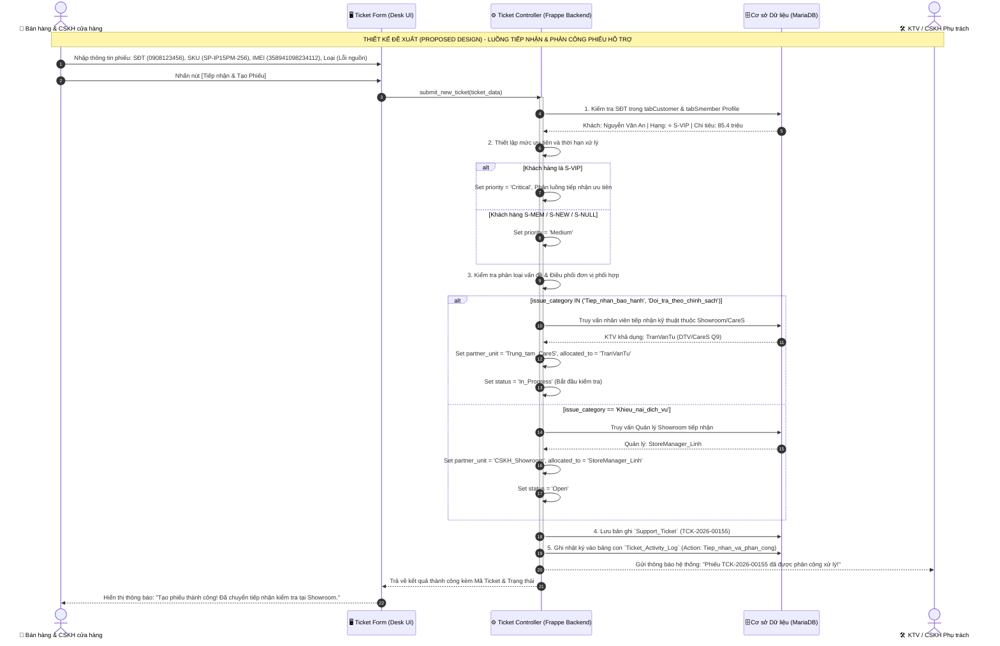
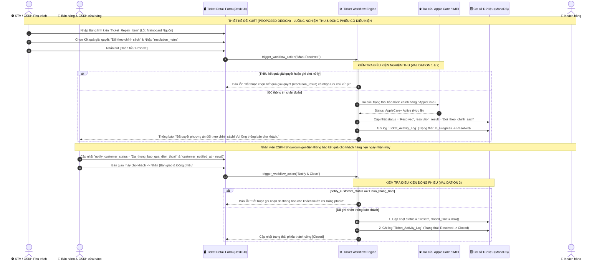

# SẢN PHẨM BÀN GIAO D05: SEQUENCE DIAGRAMS CHỌN LỌC & GHI CHÚ THIẾT KẾ
## MODULE CRM CHUỖI BÁN LẺ CÔNG NGHỆ CELLPHONES (TRÊN FRAPPE FRAMEWORK)

**Mã sản phẩm:** D05  
**Thuộc nhiệm vụ:** Nhiệm vụ 6 (Vẽ 1–2 Sequence Diagram cho luồng xử lý chính có kiểm tra điều kiện)  
**Tác giả:** Trần Quang Huy (System Analyst & Project Manager)  
**Nền tảng mục tiêu:** Frappe Framework v15.x (Custom App `cellphones_crm` độc lập)  
**Trạng thái:** Hoàn thiện Mốc M4 (Final Deliverable)  
**Nhãn xác nhận:** **THIẾT KẾ ĐỀ XUẤT (PROPOSED DESIGN)**

---

## TỔNG QUAN CẤU TRÚC BIỂU ĐỒ TUẦN TỰ (UML SEQUENCE ARCHITECTURE)

Các biểu đồ tuần tự được thiết kế theo mô hình 4 tầng phân lập rõ ràng, đồng bộ 100% với Use Case, Từ điển dữ liệu (D02), Wireframe (D03) và Ma trận phân quyền Frappe (D04):
1. **Tác nhân (Actor / User):** Khách hàng Smember, Bán hàng & CSKH cửa hàng, Kỹ thuật viên đối tác / CareS, Quản lý cửa hàng.
2. **Tầng Giao diện (UI Layer):** Form Tiếp nhận Ticket (Desk Form View), Pop-up Nghiệm thu & Kết quả giải quyết.
3. **Tầng Điều khiển Nghiệp vụ (Controller / Backend):** Frappe Server Script Controller, Workflow Engine, Routing Service.
4. **Tầng Cơ sở Dữ liệu & Dịch vụ Ngoài (Database & External Services):** MariaDB, Cổng tra cứu Apple Care API, Dữ liệu đơn hàng tham chiếu.

---

## LUỒNG 1: TIẾP NHẬN & PHÂN CÔNG PHIẾU HỖ TRỢ CÓ ĐIỀU KIỆN (TẠO & ĐIỀU PHỐI THEO SHOWROOM)

### 1. Bối cảnh Nghiệp vụ CellphoneS
Khi khách hàng mang thiết bị đến Showroom CellphoneS yêu cầu bảo hành/đổi trả (hoặc liên hệ Hotline), nhân viên Bán hàng & CSKH cửa hàng mở phiếu tiếp nhận. Hệ thống kiểm tra thông tin khách hàng, hạng Smember (`S-NULL`, `S-NEW`, `S-MEM`, `S-VIP`) và nhóm giáo dục (`S-Student`/`S-Teacher`), tính toán mức độ ưu tiên và điều phối phân công cho nhân viên xử lý hoặc chuyển đơn vị bảo hành/CareS.

### 2. Biểu đồ Sequence Diagram (Proposed Design)

### 3. Ghi chú Thiết kế & Xử lý Luồng Ngoại lệ (Exception Handling)
* **Khách hàng vãng lai không cung cấp SĐT:** Hệ thống tự động gán `customer_id = 'CUST-GUEST'`, `contact_phone = '0000000000'`, đặt mức ưu tiên `priority = 'Low'`.
* **Khách hàng đến từ cửa hàng khác (O03):** Giữ nguyên mã khách hàng duy nhất; nhân viên Showroom B chỉ được xem thông tin hồ sơ và các ticket cần thiết được phân công, không hiển thị toàn bộ lịch sử nội bộ ngoài phạm vi cửa hàng.

---

## LUỒNG 2: NGHIỆM THU KỸ THUẬT, ĐỐI CHIẾU CHÍNH SÁCH & ĐÓNG PHIẾU HỖ TRỢ CÓ ĐIỀU KIỆN

### 1. Bối cảnh Nghiệp vụ CellphoneS
Sau khi thiết bị được kiểm định lỗi phần cứng do nhà sản xuất (IC nguồn hỏng) trên máy iPhone của hội viên trong thời hạn chính sách, hệ thống thực hiện đối chiếu điều kiện (chính sách hãng và gói AppleCare+), cập nhật kết quả giải quyết (`resolution_result`), ghi nhận thông báo cho khách và đóng phiếu.

### 2. Biểu đồ Sequence Diagram (Proposed Design)

### 3. Ghi chú Thiết kế & Xử lý Luồng Ngoại lệ (Exception Handling)
* **Khách chưa thoát tài khoản iCloud:** Nếu thiết bị kích hoạt khóa Find My / iCloud, nhân viên hướng dẫn khách hỗ trợ mở khóa trước khi thực hiện các thủ tục đổi máy/bảo hành.
* **Thời hạn 30 ngày và tình trạng máy:** Thời hạn 30 ngày không đồng nghĩa mọi yêu cầu đều được đổi miễn phí hoặc đổi máy nguyên seal. Nếu máy bị cấn móp, rơi vỡ hoặc không đạt điều kiện chính sách, nhân viên ghi nhận `resolution_result = 'Khong_du_dieu_kien'` hoặc chuyển diện sửa chữa có phí sau khi thỏa thuận với khách hàng.
* **Quy tắc Thông báo Khách hàng (MVP):** Trong giai đoạn MVP, CRM hỗ trợ nhân viên ghi nhận kết quả liên lạc trực tiếp qua điện thoại hoặc tại quầy thông qua trường `notify_customer_status`, đảm bảo mọi tương tác đều được lưu vết đầy đủ trước khi đóng phiếu.

