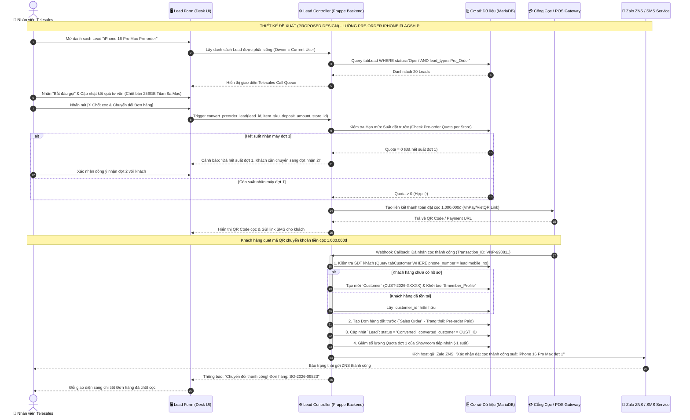
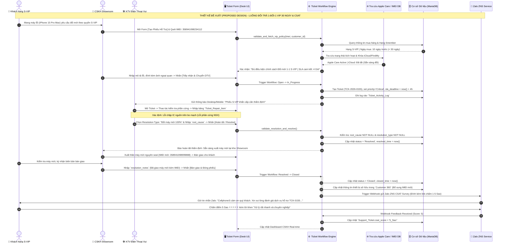

# SẢN PHẨM BÀN GIAO D05: SEQUENCE DIAGRAMS CHỌN LỌC & GHI CHÚ THIẾT KẾ
## MODULE CRM CHUỖI BÁN LẺ CÔNG NGHỆ CELLPHONES (TRÊN FRAPPE FRAMEWORK)

**Mã sản phẩm:** D05  
**Thuộc nhiệm vụ:** Nhiệm vụ 6 (Vẽ 1–2 Sequence Diagram cho luồng xử lý chính)  
**Tác giả:** Trần Quang Huy (System Analyst & Project Manager)  
**Trạng thái:** Bản nháp Mốc M3 (Draft for Cross-check)  
**Nhãn xác nhận:** **Thiết kế đề xuất (Proposed Design)**

---

## TỔNG QUAN CẤU TRÚC BIỂU ĐỒ TUẦN TỰ (UML SEQUENCE ARCHITECTURE)

Các biểu đồ tuần tự được thiết kế theo mô hình 4 tầng phân lập rõ ràng:
1. **Tác nhân (Actor / User):** Khách hàng, Nhân viên Telesales, Kỹ thuật viên Điện Thoại Vui, Quản lý CSKH.
2. **Tầng Giao diện (UI Layer):** Desk Form View, POS Checkout, Call Pop-up.
3. **Tầng Điều khiển Nghiệp vụ (Controller / Backend):** Frappe Controller, Server Scripts, Workflow Engine.
4. **Tầng Cơ sở Dữ liệu & Dịch vụ Ngoài (Database & External Services):** MariaDB, Cổng thanh toán VnPay/MoMo, Zalo ZNS Gateway, Hệ thống Tra cứu Apple Care.

---

## LUỒNG 1: QUY TRÌNH ĐẶT TRƯỚC (PRE-ORDER) IPHONE FLAGSHIP TỪ TELESALES SANG ĐƠN HÀNG

### 1. Bối cảnh Nghiệp vụ CellphoneS
Vào mùa ra mắt iPhone mới (hoặc Galaxy S Flagship), hàng chục nghìn khách hàng để lại thông tin đặt trước trên Website. Nhân viên Telesales tiếp nhận danh sách Lead từ hệ thống CRM, gọi điện tư vấn phiên bản/màu sắc, chốt đặt cọc và chuyển đổi Lead thành Khách hàng chính thức cùng Đơn hàng bán (Sales Order) để giữ suất nhận máy đợt 1.

### 2. Biểu đồ Sequence Diagram (Proposed Design)

### 3. Ghi chú Thiết kế & Luồng Ngoại lệ (Exception Handling)
- **Kiểm soát Hạn mức (Allotment / Quota Control):** Hệ thống khóa transaction bằng `SELECT FOR UPDATE` khi kiểm tra hạn mức đặt trước tại từng Showroom để tránh tình trạng bán vượt quá số lượng Apple phân bổ (Over-booking).
- **Timeout Thanh toán cọc:** Nếu sau 15 phút khách chưa thanh toán cọc qua QR Code, suất đặt giữ tạm tự động được giải phóng lại vào kho chung.

---

## LUỒNG 2: XỬ LÝ ĐỔI TRẢ 1-ĐỔI-1 TRONG 30 NGÀY CHO HỘI VIÊN S-VIP & ĐÓNG PHIẾU CSAT

### 1. Bối cảnh Nghiệp vụ CellphoneS
Đặc quyền hội viên **Smember VIP (S-VIP)** tại CellphoneS là chính sách "Lỗi là đổi mới 100% trong vòng 30 ngày đầu" kèm cam kết giải quyết khiếu nại trong 4 giờ làm việc. Quy trình này đòi hỏi sự phối hợp chặt chẽ giữa CSKH Showroom tiếp nhận, Kỹ thuật viên Điện Thoại Vui thẩm định phần cứng và tự động gửi tin nhắn Zalo ZNS mời đánh giá dịch vụ.

### 2. Biểu đồ Sequence Diagram (Proposed Design)

### 3. Ghi chú Thiết kế & Luồng Ngoại lệ (Exception Handling)
- **Xử lý Điều kiện Ràng buộc iCloud / Find My:** Trước khi duyệt đổi máy Apple, hệ thống tích hợp API kiểm tra trạng thái Khóa kích hoạt. Nếu khách chưa thoát iCloud, giao diện chặn hành động `Resolve` và yêu cầu nhân viên hướng dẫn khách tắt từ xa qua icloud.com.
- **Xử lý Ngoại quan Không đạt chuẩn (Cấn móp / Vào nước):** Nếu kỹ thuật viên phát hiện máy bị cấn móp nặng làm biến dạng khung sườn hoặc quỳ tím đổi màu (vào nước), hệ thống cho phép KTV chuyển phương án sang `Tu_choi_do_roi_vo`, ghi rõ lý do kèm ảnh chụp và tự động gửi SMS thông báo từ chối đổi 1-1 cho khách hàng.
- **Xử lý Timeout Webhook Zalo ZNS:** Nếu cổng ZNS không phản hồi sau 5 giây, giao diện vẫn hoàn tất đóng phiếu và đưa tin nhắn CSAT vào hàng đợi ngầm (Background Queue: `frappe.enqueue`) để tự động thử lại sau 3 phút.
