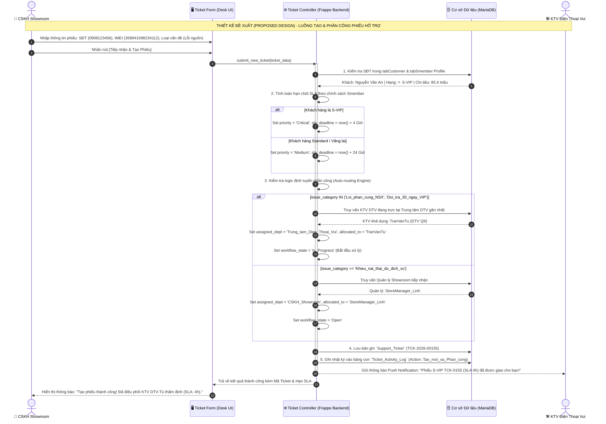
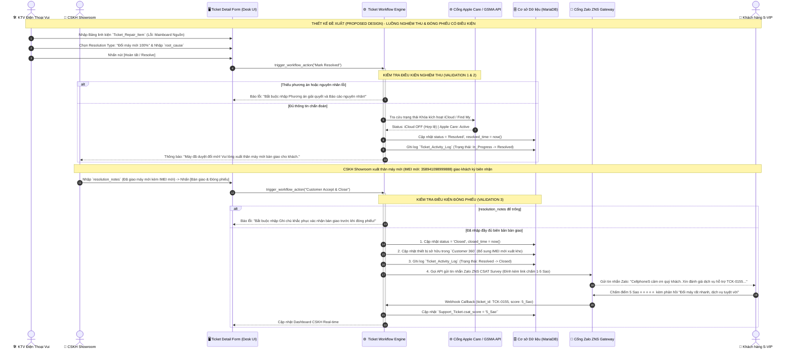

# SẢN PHẨM BÀN GIAO D05: SEQUENCE DIAGRAMS CHỌN LỌC & GHI CHÚ THIẾT KẾ
## MODULE CRM CHUỖI BÁN LẺ CÔNG NGHỆ CELLPHONES (TRÊN FRAPPE FRAMEWORK)

**Mã sản phẩm:** D05  
**Thuộc nhiệm vụ:** Nhiệm vụ 6 (Vẽ 1–2 Sequence Diagram cho luồng xử lý chính có kiểm tra điều kiện)  
**Tác giả:** Trần Quang Huy (System Analyst & Project Manager)  
**Nền tảng mục tiêu:** Frappe Framework v15 / ERPNext v15  
**Trạng thái:** Hoàn thiện Mốc M4 (Final Deliverable)  
**Nhãn xác nhận:** **THIẾT KẾ ĐỀ XUẤT (PROPOSED DESIGN)**

---

## TỔNG QUAN CẤU TRÚC BIỂU ĐỒ TUẦN TỰ (UML SEQUENCE ARCHITECTURE)

Các biểu đồ tuần tự được thiết kế theo mô hình 4 tầng phân lập rõ ràng, đồng bộ 100% với Use Case, Từ điển dữ liệu (D02), Wireframe (D03) và Ma trận phân quyền Frappe (D04):
1. **Tác nhân (Actor / User):** Khách hàng Smember, Nhân viên CSKH Showroom, Kỹ thuật viên Điện Thoại Vui, Quản lý CSKH.
2. **Tầng Giao diện (UI Layer):** Form Tiếp nhận Ticket (Desk Form View), Pop-up Nghiệm thu Kỹ thuật.
3. **Tầng Điều khiển Nghiệp vụ (Controller / Backend):** Frappe Server Script Controller, Workflow Engine, Routing Service.
4. **Tầng Cơ sở Dữ liệu & Dịch vụ Ngoài (Database & External Services):** MariaDB, Cổng tra cứu Apple Care API, Cổng gửi tin nhắn Zalo ZNS.

---

## LUỒNG 1: TIẾP NHẬN, THẨM ĐỊNH SLA & TỰ ĐỘNG ĐỊNH TUYẾN PHÂN CÔNG PHIẾU HỖ TRỢ (TẠO & PHÂN CÔNG CÓ ĐIỀU KIỆN)

### 1. Bối cảnh Nghiệp vụ CellphoneS
Khi khách hàng mang máy đến Showroom CellphoneS khiếu nại lỗi thiết bị (hoặc gọi điện qua Hotline 1800), nhân viên CSKH mở phiếu tiếp nhận. Hệ thống tự động kiểm tra hạng hội viên Smember của khách, tính toán thời hạn cam kết SLA và tự động định tuyến phân công (Auto-routing) cho Kỹ thuật viên Điện Thoại Vui (nếu là lỗi phần cứng) hoặc Quản lý Showroom (nếu là khiếu nại thái độ dịch vụ).

### 2. Biểu đồ Sequence Diagram (Proposed Design)

### 3. Ghi chú Thiết kế & Xử lý Luồng Ngoại lệ (Exception Handling)
* **Khách hàng vãng lai không cung cấp SĐT:** Hệ thống tự động gán `customer_id = 'CUST-GUEST'`, `contact_phone = '0000000000'`, đặt mức ưu tiên `priority = 'Low'` và thời hạn SLA mặc định là 48 giờ.
* **Không có Kỹ thuật viên trực ca tại địa bàn:** Hệ thống đưa Ticket vào hàng đợi chung (`Department Queue: Trung_tam_Dien_Thoai_Vui`) với trạng thái `Open`, đồng thời gửi cảnh báo Email khẩn cấp cho Quản lý Trung tâm DTV để gán việc thủ công.

---

## LUỒNG 2: NGHIỆM THU KỸ THUẬT & ĐÓNG PHIẾU HỖ TRỢ CÓ KIỂM TRA ĐIỀU KIỆN (ĐỔI TRẢ 1-ĐỔI-1 S-VIP & KHẢO SÁT CSAT)

### 1. Bối cảnh Nghiệp vụ CellphoneS
Sau khi Kỹ thuật viên Điện Thoại Vui kiểm định lỗi phần cứng do nhà sản xuất (IC nguồn hỏng) trên máy iPhone của hội viên S-VIP trong 30 ngày đầu, hệ thống thực hiện quy trình nghiệm thu, đối soát điều kiện bảo mật (iCloud), duyệt xuất đổi máy mới và đóng phiếu kèm kích hoạt khảo sát CSAT qua Zalo ZNS.

### 2. Biểu đồ Sequence Diagram (Proposed Design)

### 3. Ghi chú Thiết kế & Xử lý Luồng Ngoại lệ (Exception Handling)
* **Khách chưa thoát tài khoản iCloud:** Nếu Apple API trả về `iCloud = ON`, hệ thống lập tức chặn hành động `Mark Resolved`, hiển thị cảnh báo đỏ trên giao diện và hướng dẫn nhân viên hỗ trợ khách hàng đăng nhập `icloud.com/find` để gỡ bỏ thiết bị khỏi tài khoản từ xa trước khi tiến hành đổi máy.
* **Máy bị lỗi do người dùng (Rơi vỡ / Vào nước):** Kỹ thuật viên DTV chọn `resolution_type = 'Tu_choi_do_roi_vo'`, đính kèm ảnh chụp quỳ tím đổi màu vào bảng con `Ticket_Repair_Item`. Hệ thống tự động chuyển diện sang "Sửa chữa có phí", lập báo giá `estimated_cost` và gửi SMS xin ý kiến duyệt giá từ khách hàng.
* **Webhook Zalo ZNS Timeout:** Nếu cổng Zalo không phản hồi trong 5 giây, giao diện vẫn cho phép hoàn tất đóng phiếu và đưa tác vụ gửi tin nhắn CSAT vào hàng đợi nền (`frappe.enqueue`) để thử lại tự động theo cơ chế Exponential Backoff.
